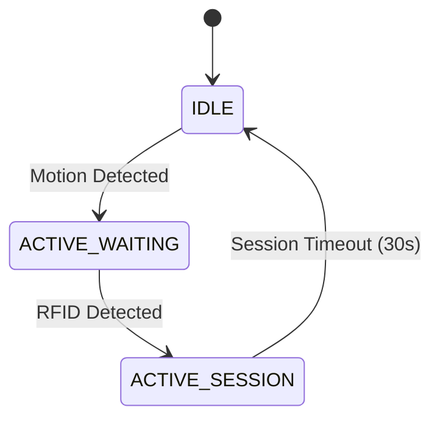
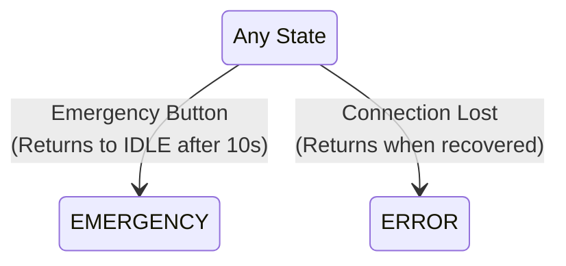

# 📜 Arduino UNO R4 — Core Responsibilities

## Responsibility 1: Emergency System
- Monitor emergency input pin (interrupt-style monitoring)
- Trigger emergency mode with immediate state transition
- Send MQTT emergency message to `campus/security/emergency`
- Immediate unlock signal to servo Arduino when triggered
- LED feedback: Solid ON during emergency
- Auto-return to IDLE after emergency timeout (10 seconds)

## Responsibility 2: RFID Relay
- Monitor RFID input pin
- Generate mock RFID value
- Send RFID value to ESP32CAM via MQTT (`campus/security/rfid`)
- LED feedback: Quick blink

## Responsibility 3: Unlock Control
- Listen for unlock commands from API via MQTT (`campus/security/unlock`)
- Send unlock signal to servo Arduino
- LED feedback: Brief blink on unlock

## Responsibility 4: Motion Activation
- Monitor motion sensor input pin
- Change state in state machine

## 🔄 State Machine Design

### Main Flow & Interrupt States

#### Normal Operation

#### Interrupt Conditions

### State Descriptions
- **IDLE**: Low power, monitoring motion
- **ACTIVE_WAITING**: Full system active, waiting for RFID
- **ACTIVE_SESSION**: Processing authenticated session
- **EMERGENCY**: Immediate unlock, overrides all states
- **ERROR**: Connection/hardware issue recovery

### Emergency as an Interrupt
The emergency system operates as a high-priority interrupt that can trigger from any state:
- 🔍 **Constant Monitoring**: Emergency pin is always checked, regardless of current state
- ⚡ **Immediate Response**: Instantly transitions to emergency handling
- 🔄 **Auto Recovery**: Returns to IDLE after 10-second timeout
- 🚨 **Priority**: Emergency checks take precedence over all other state operations

### IDLE State
- No motion detected
- Minimal power consumption
- LED: OFF
- Actively monitoring:
  - Motion sensor
  - Emergency input (high priority)

### ACTIVE_WAITING State
- Motion detected & Connected
- Full system functionality:
  - Monitoring RFID (send when detected)
  - Processing unlock commands
  - Emergency monitoring (immediate override)
- LED: Normal blink pattern
- Maintains WiFi & MQTT connections

### ACTIVE_SESSION State
- RFID detected and validated
- Session management active
- Timeout monitoring
- LED: Fast blink pattern
- Returns to ACTIVE_WAITING after session timeout

### ERROR State
- Connection or hardware issues
- Attempts automatic recovery
- LED: Error pattern (fast blink)
- Returns to IDLE after recovery

## 🎯 Milestones & Progress

### Milestone 1: Motion Detection & State Management ✅ (Feb 2024)
- [x] Implement basic state machine with new design
  - IDLE: No motion, LED off
  - ACTIVE_WAITING: Motion detected, waiting for RFID
  - ACTIVE_SESSION: RFID detected, processing session
  - EMERGENCY: Emergency triggered, LED solid
  - ERROR: Connection issues, fast LED blink
- [x] Configure motion sensor input (Pin 5)
- [x] Handle state transitions with proper logging
- [x] Implement LED patterns for each state
- [x] Test state transitions with simulated motion
  - Currently simulates motion every 10 seconds for testing
  - Will be replaced with actual sensor input

### Milestone 2: Core Communication ✅ (Feb 2024)
- [x] WiFi connection management
  - Auto-connect on startup with timeout
  - Connection monitoring with retry logic
  - Error state on failure with recovery
- [x] MQTT connection setup
  - Broker connection with auto-reconnect
  - Error handling with state transitions
  - Improved logging for debugging
- [x] Topic subscriptions and message handling
  - Subscribed to unlock channel
  - JSON message formatting
  - MQTT callback implemented
- [x] Connection recovery in ERROR state
  - Automatic retry mechanism
  - Clear error indication via LED
  - Returns to IDLE after recovery

### Milestone 3: RFID Processing ✅ (Mar 2024)
- [x] Configure RFID input pin with pullup
- [x] Mock RFID implementation
  - Random selection from predefined values
  - Configurable in config.h
- [x] MQTT message formatting with JSON
- [x] Publish to RFID topic with validation
- [x] Debounce protection (1000ms)

### Milestone 4: Emergency System 🔄 (Mar 2024 - In Progress)
- [x] Emergency input configuration (Pin 3)
- [x] Interrupt-style implementation
  - Priority check at start of main loop
  - Immediate state transition on trigger
  - Bypass normal state processing
- [x] Emergency actions
  - Immediate unlock signal (500ms pulse)
  - Emergency MQTT broadcast with JSON
  - LED feedback (solid ON)
- [ ] Timeout Implementation (Current Sprint)
  - Add EMERGENCY_TIMEOUT_MS constant (10s)
  - Track emergency start time
  - Auto-return to IDLE after timeout
  - Clear emergency flags on timeout
- [ ] Testing & Validation
  - Verify interrupt behavior from all states
  - Confirm timeout functionality
  - Test MQTT emergency broadcasts
  - Validate LED behavior

Next Steps (This Week):
1. Implement emergency timeout counter in handleState()
2. Add emergency start time tracking
3. Create timeout check in main loop
4. Add recovery logging
5. Test from all possible states

### Milestone 5: Unlock Control ✅ (Mar 2024)
- [x] Subscribe to unlock topic
- [x] Parse unlock commands with JSON
- [x] Control unlock output (500ms pulse)
- [x] Visual feedback via LED
- [x] Command validation and error handling

# 🔌 Connection Details

## Wi-Fi Configuration
- **SSID**: "iPod Mini"
- **Password**: "H0t$p0t!"
- **Status**: Auto-reconnect implemented

## MQTT Configuration
- **Broker IP**: 172.20.10.2
- **Port**: 1883
- **Client ID**: "arduino_uno_r4"
- **Status**: Auto-reconnect implemented

## MQTT Topics
| Topic | Role | Direction | Status |
|-------|------|-----------|---------|
| `campus/security/emergency` | Emergency alerts | Publish | Implemented |
| `campus/security/unlock` | Door control | Subscribe | Implemented |
| `campus/security/rfid` | RFID data relay | Publish | Implemented |

## Pin Configuration
- **Emergency Input**: Pin 3 (with pullup, triggers on HIGH)
- **RFID Input**: Pin 2 (with pullup, triggers on HIGH)
- **LED**: Built-in LED (configured for status indication)
- **Unlock Output**: Pin 4 (to servo Arduino, 500ms pulse)
- **Motion Sensor**: Pin 5 (to be implemented)

# 🛠️ Dependencies
- WiFiS3 library (for WiFi connectivity)
- PubSubClient (MQTT communication)
- ArduinoJson (JSON message formatting)
