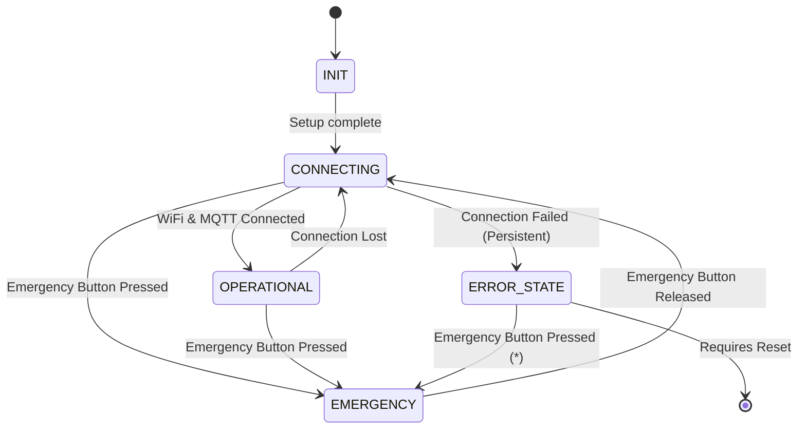

# Arduino Mega - Central Control Firmware

## Overview

This firmware runs on the Arduino Mega, which serves as the central sensor hub and signal coordinator for the Campus Security Enhancement System (CSES). Its primary responsibilities include:

*   Reading input from the Motion Sensor, RFID Sensor, and Emergency Button.
*   Generating digital signal outputs to the ESP32-CAM based on Motion and RFID detection.
*   Generating a digital trigger signal output to the Arduino Uno (Servo Controller) based on Emergency Button presses or MQTT unlock commands.
*   Connecting to the network via WiFi.
*   Communicating with the MQTT broker to publish emergency alerts and subscribe to unlock commands.
*   Providing status logging via the Serial interface.

This firmware replaces the previous architecture where the ESP32 and Arduino Uno handled sensors independently.

## Features

*   **Sensor Integration:** Reads digital states from Motion, RFID (detects LOW), and Emergency Button sensors with debouncing.
*   **Signal Generation (to ESP32):** Provides real-time digital signals (`HIGH`/`LOW`) on dedicated pins corresponding to the current state of the Motion and RFID sensors.
*   **Servo Trigger Signal (to Uno):** Sends a timed `HIGH` pulse on a dedicated pin to trigger the servo actuation on the connected Arduino Uno.
*   **WiFi Connectivity:** Connects to the configured WiFi network.
*   **MQTT Communication:**
    *   Connects to the MQTT broker.
    *   Publishes JSON messages to the `campus/security/emergency` topic when the emergency button is activated.
    *   Subscribes to the `campus/security/unlock` topic and triggers the servo signal upon receiving a message.
*   **State Machine:** Simple state management for handling connection, operation, and emergency modes.
*   **Serial Logging:** Outputs status, sensor readings, MQTT activity, and errors to the Serial monitor for debugging.
*   **Mock RFID Logging:** Logs a generated mock RFID tag when the RFID sensor is triggered (for debugging/verification, not sent over wire).

## State Machine

The firmware operates based on a simple state machine:

(*) Note: Emergency action (servo trigger) occurs even if already in ERROR_STATE, but state transitions to EMERGENCY.

*   **INIT:** Initial setup phase during `setup()`.
*   **CONNECTING:** Establishes WiFi and MQTT connections. Retries periodically.
*   **OPERATIONAL:** The main running state. Monitors sensors, updates output signals, handles MQTT messages (`loop()`, callbacks), and checks for the emergency button trigger.
*   **EMERGENCY:** Entered immediately when the emergency button is pressed (LOW signal), regardless of the previous state. 
    *   **Action:** Immediately triggers the servo unlock signal (`SERVO_TRIGGER_OUT_PIN`).
    *   **Notification:** Attempts to publish an MQTT message to `campus/security/emergency` *only if* currently connected to the broker (best-effort).
    *   **Exit:** Remains in this state until the emergency button is released (HIGH signal), then transitions back to `CONNECTING` to ensure network status is verified.
*   **ERROR_STATE:** Indicates a critical failure (e.g., WiFi module not found). Emergency button still triggers servo unlock.

## Configuration

All user-configurable parameters are defined in `src/config.h`:

*   **Pin Definitions:** `MOTION_SENSOR_PIN`, `RFID_SENSOR_PIN`, `EMERGENCY_PIN`, `MOTION_SIGNAL_OUT_PIN`, `RFID_SIGNAL_OUT_PIN`, `SERVO_TRIGGER_OUT_PIN`. **Note:** Placeholder pin numbers are used; update these to match your actual hardware wiring.
*   **WiFi Configuration:** `WIFI_SSID`, `WIFI_PASSWORD`.
*   **MQTT Configuration:** `MQTT_BROKER` (IP address), `MQTT_PORT`, `MQTT_CLIENT_ID`.
*   **Timing Constants:** `SENSOR_DEBOUNCE_TIME`, `SERVO_TRIGGER_DURATION`, connection retry delays, etc.
*   **Mock RFID Values:** `MOCK_RFIDS` array (for logging purposes only).

**Important:** Ensure you update the placeholder pin numbers and network credentials in `src/config.h` before compiling and uploading.

## Dependencies

*   **Hardware:**
    *   Arduino Mega 2560 (or compatible)
    *   WiFi Module compatible with WiFiS3 library (e.g., Uno R4 WiFi's module, or requires library change for ESP-based modules like ESP-01)
    *   Motion Sensor (Digital Output)
    *   RFID Reader (Digital Output, configured for LOW on detection)
    *   Emergency Button (Digital Output)
*   **Libraries (Managed by PlatformIO):**
    *   `WiFiS3` (or alternative WiFi library depending on hardware)
    *   `PubSubClient` (by Nick O'Leary)
    *   `ArduinoJson` (by Benoit Blanchon)
*   **Development Environment:**
    *   [PlatformIO IDE](https://platformio.org/)

## Setup & Flashing

1.  **Clone/Open Project:** Open this project folder (`ArduinoMega`) in VS Code with the PlatformIO extension installed.
2.  **Configure:** Edit `src/config.h` to set your correct pin assignments, WiFi SSID/Password, and MQTT Broker IP address.
3.  **Build:** Use the PlatformIO `Build` command (Checkmark icon in the status bar or `Ctrl+Alt+B`).
4.  **Upload:** Connect the Arduino Mega via USB and use the PlatformIO `Upload` command (Right arrow icon in the status bar or `Ctrl+Alt+U`).
5.  **Monitor:** Use the PlatformIO `Serial Monitor` command (Plug icon in the status bar or `Ctrl+Alt+S`) to view log output (Baud rate: 115200).

## Operation

Once flashed and powered:

1.  The Mega enters the `CONNECTING` state, attempting to connect to WiFi and then the MQTT broker.
2.  **Emergency Override:** At any point, if the `EMERGENCY_PIN` reads LOW (button pressed), the Mega immediately transitions to the `EMERGENCY` state, triggers the servo unlock signal (`SERVO_TRIGGER_OUT_PIN`), and attempts to send an MQTT alert if connected.
3.  Upon successful connection, it enters the `OPERATIONAL` state (if not overridden by Emergency).
4.  In `OPERATIONAL` state:
    *   It continuously reads the Motion and RFID sensor pins (with debouncing).
    *   The `MOTION_SIGNAL_OUT_PIN` mirrors the debounced state of the Motion sensor (`HIGH` when motion detected).
    *   The `RFID_SIGNAL_OUT_PIN` mirrors the debounced state of the RFID sensor (`HIGH` when RFID detected - LOW input).
    *   It listens for messages on the `campus/security/unlock` MQTT topic. If a message is received, it activates the `SERVO_TRIGGER_OUT_PIN` for `SERVO_TRIGGER_DURATION` milliseconds.
    *   It monitors the `EMERGENCY_PIN`. If pressed, it transitions to `EMERGENCY` (as described in step 2).
5.  In the `EMERGENCY` state:
    *   The servo signal is active (managed by `handleServoTrigger` to ensure correct duration).
    *   It waits for the emergency button to be released (pin reads HIGH) before transitioning back to the `CONNECTING` state.
6.  If connections are lost while `OPERATIONAL`, it returns to the `CONNECTING` state to attempt reconnection.
7.  Status and events are logged to the Serial Monitor.
