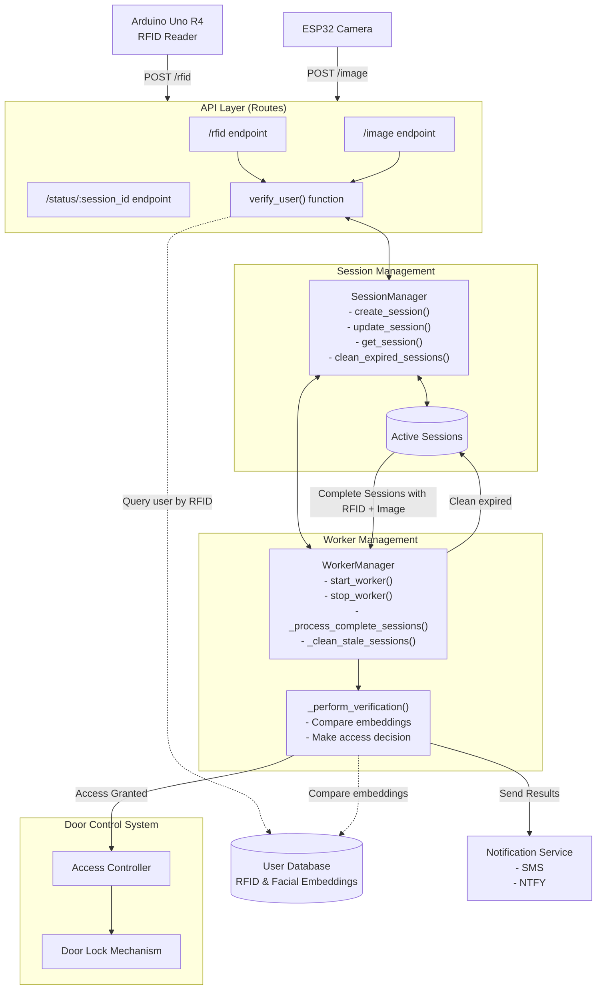
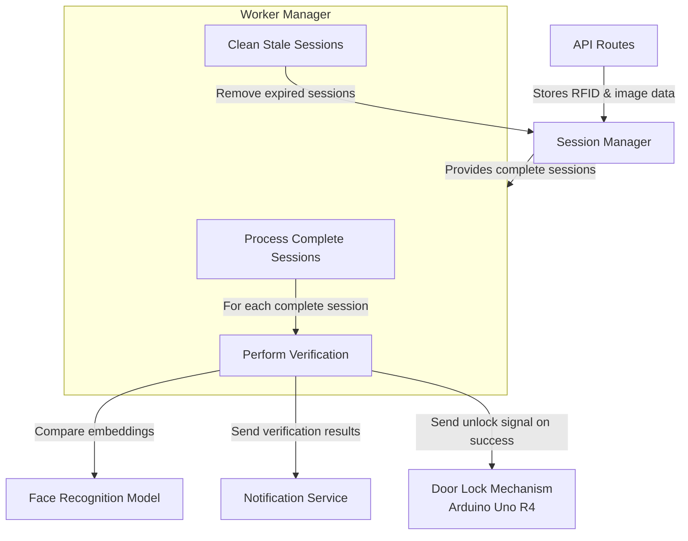

# System Architecture

<!-- TODO: Improve this architecture by adding in motion sensors and comparing with the architecture diagram in the other file -->



# System Component Diagrams

## Verification Process



## Client Management

```mermaid
flowchart TD
    %% Position RFID in top left, Camera in top right, UDP in middle
    RFID["Arduino Uno R4<br>(RFID Reader)"] ---|"Scans RFID tag"| UDP
    CAM["ESP32-Cam Module"] ---|"Captures Image"| UDP
    
    %% Place UDP broadcast in middle
    UDP["UDP Broadcast<br>Channel"]
    
    %% API at bottom
    API["Flask Server API"]
    
    %% Connection flows
    UDP -->|"Broadcast Session ID"| RFID
    UDP -->|"Broadcast Session ID"| CAM
    RFID -->|"POST /rfid<br>(with session ID)"| API
    CAM -->|"POST /image<br>(with session ID)"| API
    
    %% Position styling
    classDef leftNode fill:#f9f,stroke:#333,stroke-width:2px;
    classDef rightNode fill:#bbf,stroke:#333,stroke-width:2px;
    classDef centerNode fill:#ff9,stroke:#333,stroke-width:2px;
    
    class RFID leftNode;
    class CAM rightNode;
    class UDP centerNode;
    
    %% Force layout positioning
    RFID:::leftNode -. invisible .- UDP:::centerNode -. invisible .- CAM:::rightNode
    ```