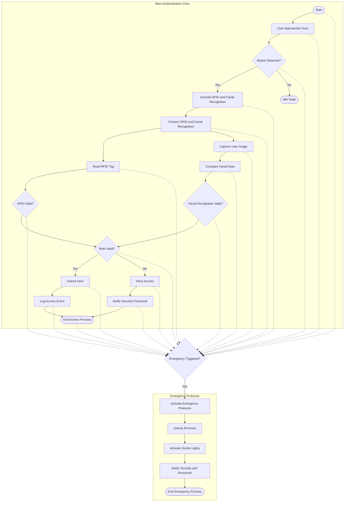

# Flow Diagram

## Main Authetication Flow Diagram

```mermaid
flowchart TD
    %% Main Authentication Flow
    subgraph MainProcess [Main Authentication Flow]
        Start([Start])
        Start --> UserApproaches["User Approaches Door"]
        UserApproaches --> MotionDetected{"Motion Detected?"}
        
        MotionDetected -- Yes --> ActivateAuth["Activate RFID and Facial Recognition"]
        MotionDetected -- No --> IdleState([Idle State])
        
        ActivateAuth --> ParallelAuth["Perform RFID and Facial Recognition"]
        
        %% Parallel Authentication
        ParallelAuth --> RFID["Read RFID Tag"]
        ParallelAuth --> FacialRecog["Capture User Image"]
        
        RFID --> ValidateRFID{"RFID Valid?"}
        FacialRecog --> CompareFacialData["Compare Facial Data"]
        CompareFacialData --> FacialRecogValid{"Facial Recognition Valid?"}
        
        %% Combined Validation
        ValidateRFID & FacialRecogValid --> CombinedValid{"Both Valid?"}
        
        CombinedValid -- Yes --> UnlockDoor["Unlock Door"]
        CombinedValid -- No --> DenyAccess["Deny Access"]
        
        %% Post-Authentication Actions
        UnlockDoor --> LogAccess["Log Access Event"]
        LogAccess --> EndAccess([End Access Process])
        
        DenyAccess --> NotifySecurity["Notify Security Personnel"]
        NotifySecurity --> EndAccess
    end

     %% Emergency Protocols
    subgraph EmergencyProtocol [Emergency Protocols]
        ActivateEmergency["Activate Emergency Protocols"]
        UnlockAllDoors["Unlock All Doors"]
        ActivateStrobeLights["Activate Strobe Lights"]
        NotifyAllSecurity["Notify Security and Personnel"]
        EndEmergency([End Emergency Process])
        
        ActivateEmergency --> UnlockAllDoors
        UnlockAllDoors --> ActivateStrobeLights
        ActivateStrobeLights --> NotifyAllSecurity
        NotifyAllSecurity --> EndEmergency
    end
    
```

### Main Authentication Flow with Evacuation Protocol

```mermaid
flowchart TD
    %% Main Authentication Flow
    subgraph MainProcess [Main Authentication Flow]
        Start([Start])
        Start --> UserApproaches["User Approaches Door"]
        UserApproaches --> MotionDetected{"Motion Detected?"}
        
        MotionDetected -- Yes --> ActivateAuth["Activate RFID and Facial Recognition"]
        MotionDetected -- No --> IdleState([Idle State])
        
        ActivateAuth --> ParallelAuth["Perform RFID and Facial Recognition"]
        
        %% Parallel Authentication
        ParallelAuth --> RFID["Read RFID Tag"]
        ParallelAuth --> FacialRecog["Capture User Image"]
        
        RFID --> ValidateRFID{"RFID Valid?"}
        FacialRecog --> CompareFacialData["Compare Facial Data"]
        CompareFacialData --> FacialRecogValid{"Facial Recognition Valid?"}
        
        %% Combined Validation
        ValidateRFID & FacialRecogValid --> CombinedValid{"Both Valid?"}
        
        CombinedValid -- Yes --> UnlockDoor["Unlock Door"]
        CombinedValid -- No --> DenyAccess["Deny Access"]
        
        %% Post-Authentication Actions
        UnlockDoor --> LogAccess["Log Access Event"]
        LogAccess --> EndAccess([End Access Process])
        
        DenyAccess --> NotifySecurity["Notify Security Personnel"]
        NotifySecurity --> EndAccess
    end

     %% Emergency Protocols
    subgraph EmergencyProtocol [Emergency Protocols]
        ActivateEmergency["Activate Emergency Protocols"]
        UnlockAllDoors["Unlock All Doors"]
        ActivateStrobeLights["Activate Strobe Lights"]
        NotifyAllSecurity["Notify Security and Personnel"]
        EndEmergency([End Emergency Process])
        
        ActivateEmergency --> UnlockAllDoors
        UnlockAllDoors --> ActivateStrobeLights
        ActivateStrobeLights --> NotifyAllSecurity
        NotifyAllSecurity --> EndEmergency
    end
    
    %% Emergency Interrupt
    EmergencyCheck{"Emergency Triggered?"}
    
    %% Connect Emergency Check to Main Process
    Start -.-> EmergencyCheck
    UserApproaches -.-> EmergencyCheck
    MotionDetected -.-> EmergencyCheck
    ActivateAuth -.-> EmergencyCheck
    ParallelAuth -.-> EmergencyCheck
    RFID -.-> EmergencyCheck
    ValidateRFID -.-> EmergencyCheck
    FacialRecog -.-> EmergencyCheck
    CompareFacialData -.-> EmergencyCheck
    FacialRecogValid -.-> EmergencyCheck
    CombinedValid -.-> EmergencyCheck
    UnlockDoor -.-> EmergencyCheck
    LogAccess -.-> EmergencyCheck
    DenyAccess -.-> EmergencyCheck
    NotifySecurity -.-> EmergencyCheck
    EndAccess -.-> EmergencyCheck
    
    %% Emergency Activation
    EmergencyCheck -- Yes --> ActivateEmergency
```
