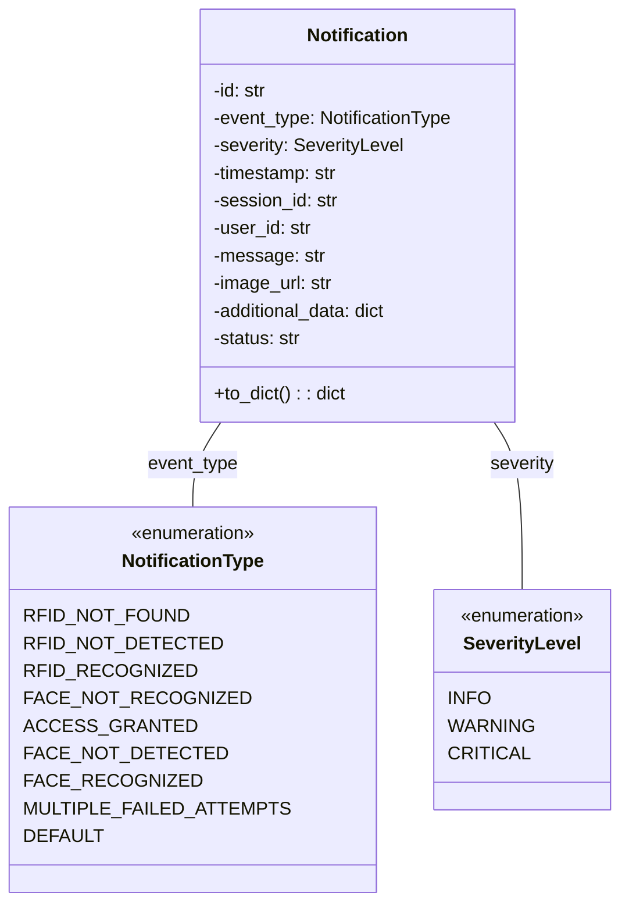
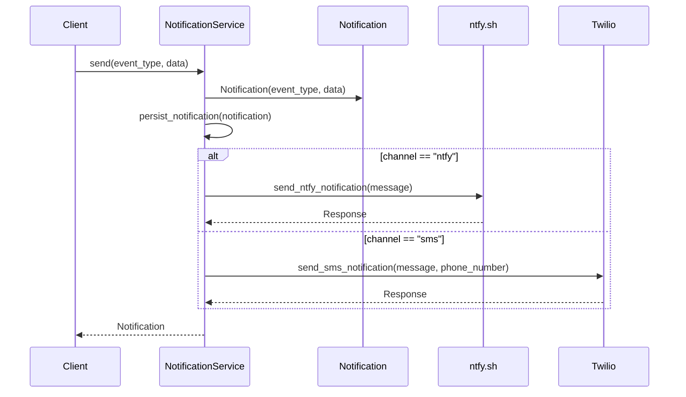
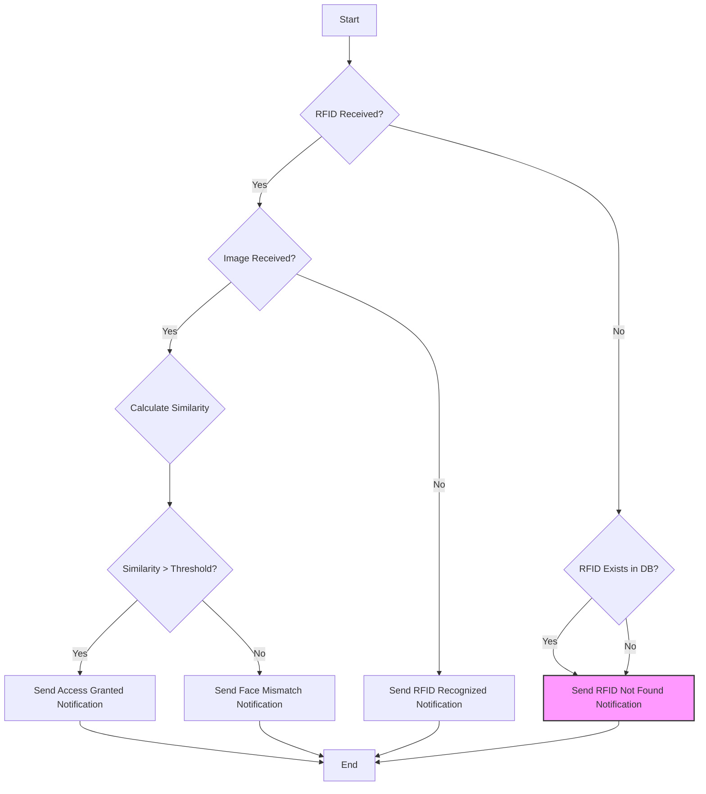

# Notitication Class Diagram

```mermaid
classDiagram
    class Notification {
        -id: str
        -event_type: NotificationType
        -severity: SeverityLevel
        -timestamp: str
        -session_id: str
        -user_id: str
        -message: str
        -image_url: str
        -additional_data: dict
        -status: str
        +to_dict(): dict
    }

    class NotificationType {
        <<enumeration>>
        RFID_NOT_FOUND
        RFID_NOT_DETECTED
        RFID_RECOGNIZED
        FACE_NOT_RECOGNIZED
        ACCESS_GRANTED
        FACE_NOT_DETECTED
        FACE_RECOGNIZED
        MULTIPLE_FAILED_ATTEMPTS
        DEFAULT
    }

    class SeverityLevel {
        <<enumeration>>
        INFO
        WARNING
        CRITICAL
    }

    Notification -- NotificationType : event_type
    Notification -- SeverityLevel : severity
```

# Notification Sequence Diagram

```mermaid
sequenceDiagram
    participant Client
    participant NotificationService
    participant Notification
    participant ntfy.sh
    participant Twilio

    Client->>NotificationService: send(event_type, data)
    NotificationService->>Notification: Notification(event_type, data)
    NotificationService->>NotificationService: persist_notification(notification)
    alt channel == "ntfy"
        NotificationService->>ntfy.sh: send_ntfy_notification(message)
        ntfy.sh-->>NotificationService: Response
    else channel == "sms"
        NotificationService->>Twilio: send_sms_notification(message, phone_number)
        Twilio-->>NotificationService: Response
    end
    NotificationService-->>Client: Notification
```

<!-- TODO: Update this flow diagram to showcase the types of notifications -->
# Notification Flow Diagram

```mermaid
graph TD
    A[Start] --> B{RFID Received?};
    B -- Yes --> C{Image Received?};
    B -- No --> D{RFID Exists in DB?};
    C -- Yes --> E{Calculate Similarity};
    C -- No --> F[Send RFID Recognized Notification];
    D -- Yes --> G[Send RFID Not Found Notification];
    D -- No --> G;
    E --> H{Similarity > Threshold?};
    H -- Yes --> I[Send Access Granted Notification];
    H -- No --> J[Send Face Mismatch Notification];
    F --> K[End];
    G --> K;
    I --> K;
    J --> K;
    style G fill:#f9f,stroke:#333,stroke-width:2px
```