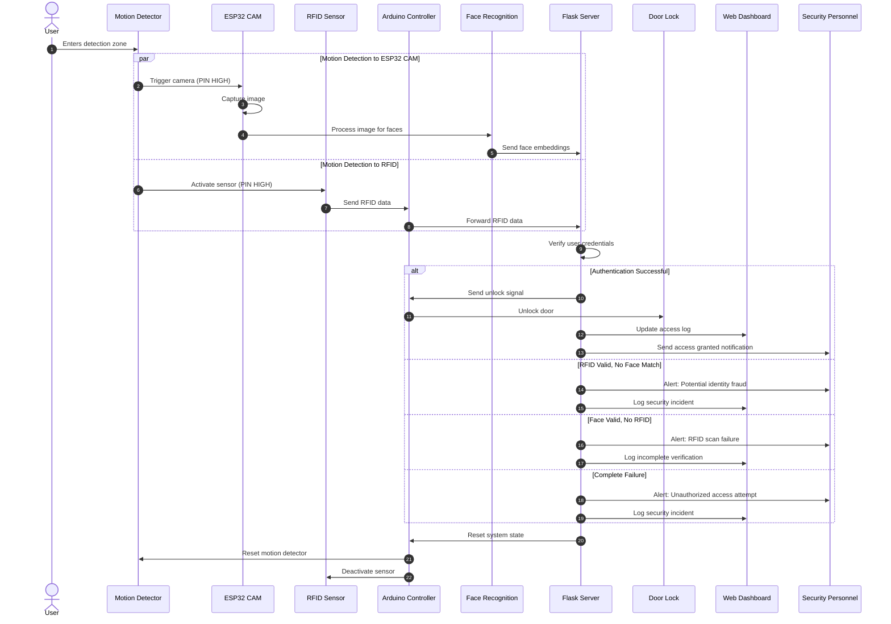

# Sequence Diagram

```mermaid
sequenceDiagram
    autonumber
    
    %% Define participants 
    actor User
    participant MD as Motion Detector
    participant ESP as ESP32 CAM
    participant RFID as RFID Sensor
    participant ARD as Arduino Controller
    participant FR as Face Recognition
    participant API as Flask Server
    participant LOCK as Door Lock
    participant WEB as Web Dashboard
    participant SEC as Security Personnel

    %% Initial trigger
    User->>MD: Enters detection zone
    
    %% Parallel processes start
    par Motion Detection to ESP32 CAM
        MD->>ESP: Trigger camera (PIN HIGH)
        ESP->>ESP: Capture image
        ESP->>FR: Process image for faces
        FR->>API: Send face embeddings
    and Motion Detection to RFID
        MD->>RFID: Activate sensor (PIN HIGH)
        RFID->>ARD: Send RFID data
        ARD->>API: Forward RFID data
    end

    %% Server processing
    API->>API: Verify user credentials
    
    %% Response handling
    alt Authentication Successful
        API->>ARD: Send unlock signal
        ARD->>LOCK: Unlock door
        API->>WEB: Update access log
        API->>SEC: Send access granted notification
    else RFID Valid, No Face Match
        API->>SEC: Alert: Potential identity fraud
        API->>WEB: Log security incident
    else Face Valid, No RFID
        API->>SEC: Alert: RFID scan failure
        API->>WEB: Log incomplete verification
    else Complete Failure
        API->>SEC: Alert: Unauthorized access attempt
        API->>WEB: Log security incident
    end

    %% System reset
    API->>ARD: Reset system state
    ARD->>MD: Reset motion detector
    ARD->>RFID: Deactivate sensor
```