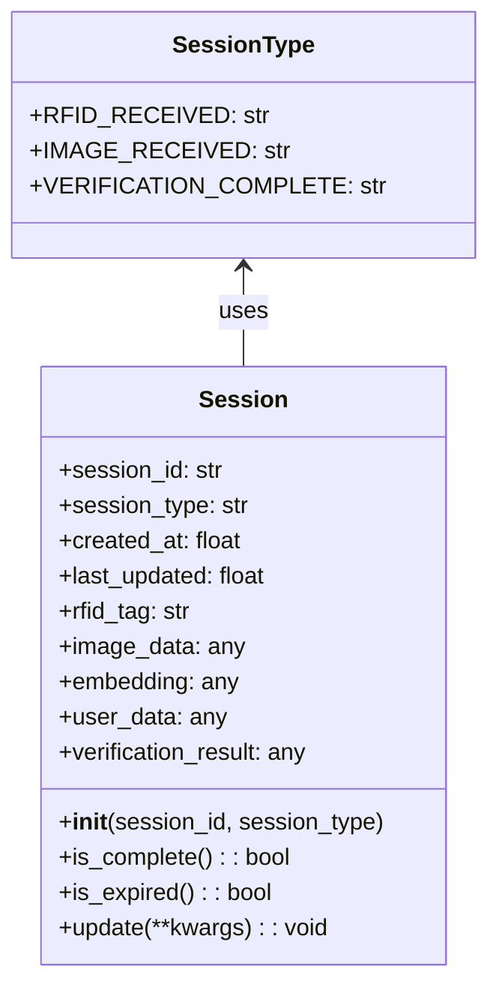
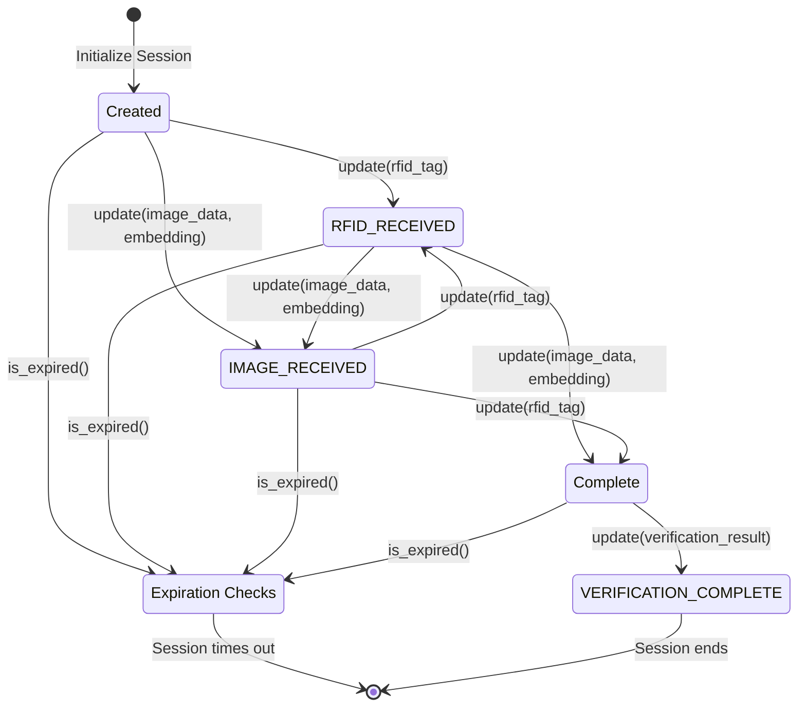

# Session Management Diagrams

## Session Class Diagram

```mermaid
classDiagram
    class SessionType {
        +RFID_RECEIVED: str
        +IMAGE_RECEIVED: str
        +VERIFICATION_COMPLETE: str
    }

    class Session {
        +session_id: str
        +session_type: str
        +created_at: float
        +last_updated: float
        +rfid_tag: str
        +image_data: any
        +embedding: any
        +user_data: any
        +verification_result: any
        +__init__(session_id, session_type)
        +is_complete(): bool
        +is_expired(): bool
        +update(**kwargs): void
    }

    SessionType <-- Session : uses
```

## Session State Diagram

```mermaid
    stateDiagram-v2
    [*] --> Created: Initialize Session
    
    state "Expiration Checks" as Expired
    Created --> Expired: is_expired()
    Expired --> [*]: Session times out
    
    Created --> RFID_RECEIVED: update(rfid_tag)
    Created --> IMAGE_RECEIVED: update(image_data, embedding)
    
    RFID_RECEIVED --> Expired: is_expired()
    IMAGE_RECEIVED --> Expired: is_expired()
    
    RFID_RECEIVED --> IMAGE_RECEIVED: update(image_data, embedding)
    IMAGE_RECEIVED --> RFID_RECEIVED: update(rfid_tag)
    
    RFID_RECEIVED --> Complete: update(image_data, embedding)
    IMAGE_RECEIVED --> Complete: update(rfid_tag)
    
    Complete --> Expired: is_expired()
    
    Complete --> VERIFICATION_COMPLETE: update(verification_result)
    VERIFICATION_COMPLETE --> [*]: Session ends
```