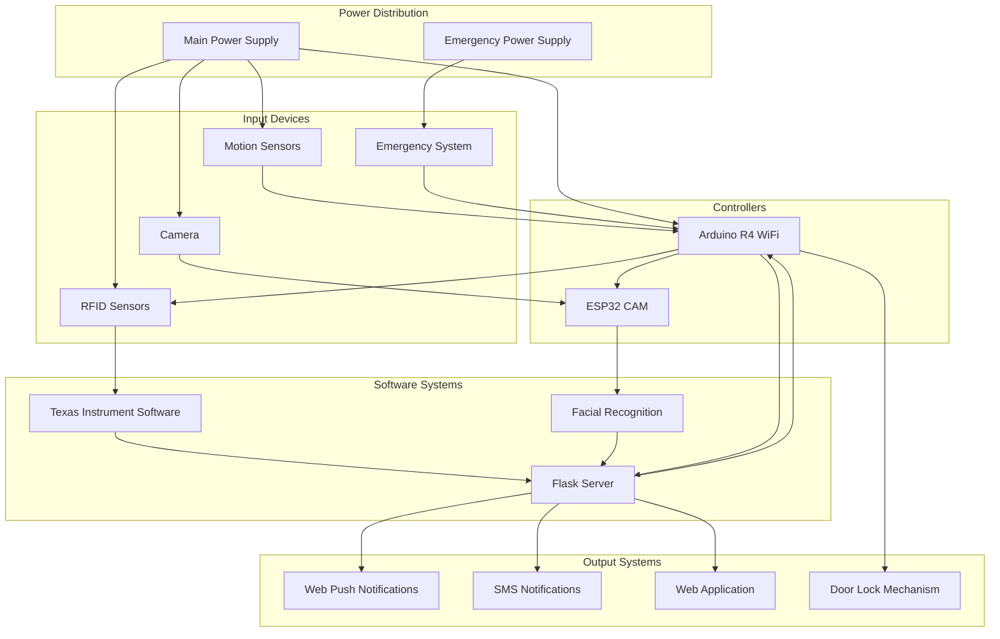

# System Overview

```mermaid
graph TD
    %% Define subgraphs for logical grouping
    subgraph Sensors ["Input Devices"]
        MotionSensor[Motion Sensors]
        EMERGENCY[Emergency System]
        RFIDReader[RFID Sensors]
        Camera[Camera]
    end

    subgraph Controllers ["Controllers"]
        Arduino[Arduino R4 WiFi]
        ESP32[ESP32 CAM]
    end

    subgraph Software ["Software Systems"]
        TEXAS[Texas Instrument Software]
        FACERECOG[Facial Recognition]
        FlaskServer[Flask Server]
    end

    subgraph Outputs ["Output Systems"]
        WEBNOTIFS[Web Push Notifications]
        TextNotifs[SMS Notifications]
        WebApp[Web Application]
        Lock[Door Lock Mechanism]
    end

    subgraph Power ["Power Distribution"]
        MainPower[Main Power Supply]
        EmergencyPowerSupply[Emergency Power Supply]
    end

    %% Sensor Connections
    MotionSensor --> Arduino
    EMERGENCY --> Arduino
    RFIDReader --> TEXAS
    Camera --> ESP32
    
    %% Software Processing
    ESP32 --> FACERECOG
    TEXAS --> FlaskServer
    FACERECOG --> FlaskServer

    %% Controller Communications
    Arduino --> ESP32
    Arduino --> RFIDReader
    Arduino --> FlaskServer
    FlaskServer --> Arduino

    %% Output Connections
    FlaskServer --> WEBNOTIFS
    FlaskServer --> TextNotifs
    FlaskServer --> WebApp
    Arduino --> Lock

    %% Power Distribution
    MainPower --> Arduino
    MainPower --> MotionSensor
    MainPower --> RFIDReader
    MainPower --> Camera
    EmergencyPowerSupply --> EMERGENCY


    class MotionSensor,EMERGENCY,RFIDReader,Camera sensor
    class Arduino,ESP32 controller
    class TEXAS,FACERECOG,FlaskServer software
    class WEBNOTIFS,TextNotifs,WebApp,Lock output
    class MainPower power
    class EmergencyPowerSupply emergency
```