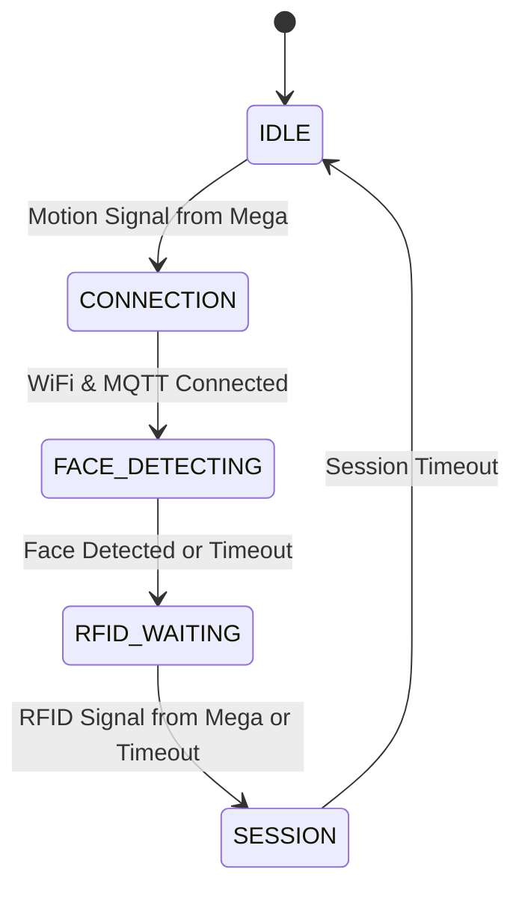
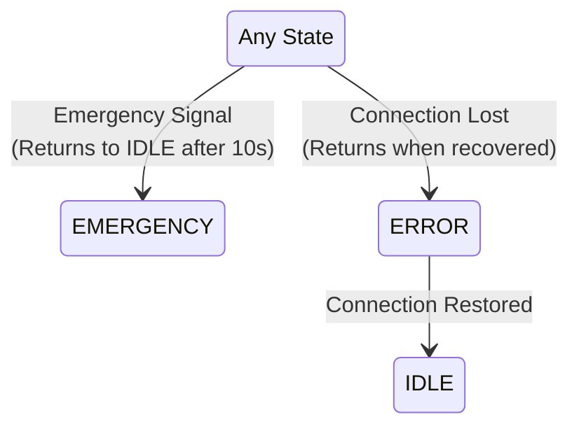

# 📜 ESP32-CAM — Core Responsibilities

## Responsibility 1: Trigger on Motion Signal from Arduino Mega
- Monitor input pin for motion signal from Arduino Mega.
- LED feedback: Normal blink during processing
- Transitions system to active state (CONNECTION)

## Responsibility 2: Face Detection and Image Capturing
- Attempts face detection using a lightweight algorithm.
- Captures an image regardless of whether a face was successfully detected.
- Converts the captured JPEG image to Base64 for transmission.

## Responsibility 3: Session Management
- Generate unique session IDs.
- Monitor input pin for RFID signal from Arduino Mega.
- Create JSON payload including:
  - Session ID
  - Image data (Base64-encoded) - *Always sent if image capture is successful.*
  - `face_detected` status (boolean) - *Indicates if a face was found in the sent image.*
  - `rfid_detected` status (boolean) - *Based on signal from Mega.*
  - Timestamp
  - Device identification
- Publish payload to MQTT channel `campus/security/session`.
- LED feedback: Fast blink during active session.

## Responsibility 4: Emergency Monitoring
- Monitor emergency channel via MQTT channel `/emergency`
- Immediate state transition on emergency
- Pause all face capture and session activities
- LED feedback: Solid ON during emergency
- Auto-return to IDLE after timeout (10 seconds)

## 🔄 State Machine Design

### Main Flow & Interrupt States

#### Normal Operation (Continuous Flow)

#### Interrupt Conditions (Updated)

### State Descriptions

#### IDLE State
- Low power mode
- Monitoring input pin for motion signal from Arduino Mega.
- LED: OFF
- No WiFi or MQTT connections
- No image capture
- Transitions to CONNECTION on receiving motion signal from Mega.

#### CONNECTION State
- Motion signal received, establishing connections
- Attempts WiFi connection
- Attempts MQTT connection after WiFi
- LED: Slow blink (1000ms)
- 5-second retry delay between attempts
- Transitions to FACE_DETECTING when connected
- Transitions to ERROR if connections fail

#### FACE_DETECTING State (Updated)
- WiFi and MQTT connected.
- Camera active, attempts face detection.
- LED: Normal blink (500ms).
- 10-second timeout period.
- Transitions to RFID_WAITING after attempt (face detected or timeout).
- *An image capture is typically triggered later in the SESSION state.*

#### RFID_WAITING State (Updated)
- Face detected or timeout occurred
- Waiting for RFID signal on dedicated input pin from Arduino Mega.
- LED: Fast blink (200ms)
- 5-second timeout period
- Transitions to SESSION on receiving RFID signal OR timeout
- Logs RFID detection status for API processing
- Continues flow regardless of detection result

#### SESSION State (Updated)
- Face detection status (`true`/`false`) and RFID detection status (`true`/`false`) recorded.
- Captures an image.
- Creates the JSON payload, including the image data (Base64) and the detection status flags.
- Publishes the payload to `campus/security/session`.
- LED: Very fast blink (100ms).
- Transitions to IDLE on timeout.

#### EMERGENCY State
- All normal operations paused
- 10-second timeout period
- LED: Solid ON
- Auto-returns to IDLE after timeout

#### ERROR State
- Connection/hardware issue recovery
- Resets connection flags
- 5-second retry delay between attempts
- LED: Error pattern (very fast blink)
- Returns to IDLE when connections restored

## 🔌 Connection Details

### MQTT Configuration
- **Topics**:
  - `campus/security/session`: Session data publishing (Note: Changed from `/session`)
  - `campus/security/emergency`: Emergency channel monitoring (subscription) (Note: Changed from `/emergency`)

### Camera Configuration
- JPEG image capture.
- Base64 encoding for transmission.
- Attempts face detection; result included in payload.

## 🛠️ Dependencies
- ESP32 Camera library
- PubSubClient (MQTT communication)
- ArduinoJson (JSON formatting)
- WiFi library
- Base64 library

## 💡 LED Status Indicators
- **OFF**: IDLE state
- **Slow Blink**: CONNECTION
- **Normal Blink**: FACE_DETECTING
- **Fast Blink**: RFID_WAITING
- **Very Fast Blink**: SESSION
- **Solid ON**: EMERGENCY state
- **Error Pattern**: ERROR state
