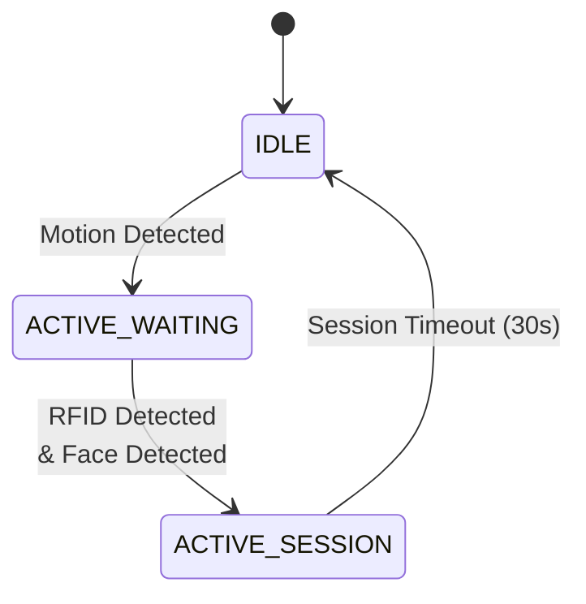
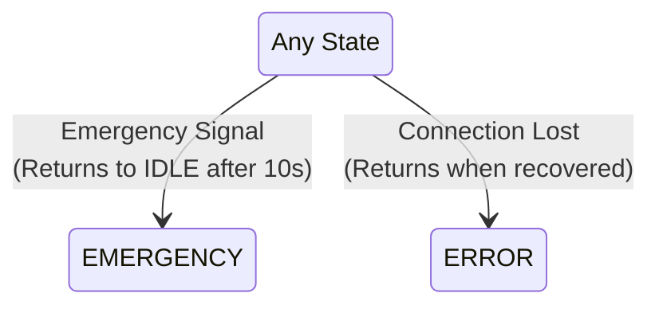

# 📜 ESP32-CAM — Core Responsibilities

## Responsibility 1: Motion Detection & Face Processing
- Monitor motion sensor (or simulate motion triggers)
- Capture images when motion is detected
- Perform face detection using lightweight algorithm
- Convert captured JPEG to Base64 for transmission
- Subscribe to `/rfid` channel for RFID data reception
- LED feedback: Normal blink during processing

## Responsibility 2: Session Management
- Generate unique session IDs
- Combine face data with RFID status
- Create JSON payload with:
  - Session ID
  - Face data (Base64-encoded)
  - RFID status
  - Timestamp
  - Device identification
- Publish to MQTT channel `/session`
- LED feedback: Fast blink during active session

## Responsibility 3: Emergency Monitoring
- Monitor emergency channel via MQTT channel `/emergency`
- Immediate state transition on emergency
- Pause all face capture and session activities
- LED feedback: Solid ON during emergency
- Auto-return to IDLE after timeout (10 seconds)

## 🔄 State Machine Design

### Main Flow & Interrupt States

#### Normal Operation

#### Interrupt Conditions

### State Descriptions

#### IDLE State
- Low power mode
- Monitoring motion sensor
- LED: OFF
- Actively monitoring emergency channel

#### ACTIVE_WAITING State
- Motion detected & system active
- Periodic image capture and face detection
- Listening for RFID signal via MQTT
- LED: Normal blink pattern

#### ACTIVE_SESSION State
- Face detected and RFID data received
- Session payload construction and publishing
- 30-second timeout monitoring
- LED: Fast blink pattern

#### EMERGENCY State
- All normal operations paused
- 10-second timeout period
- LED: Solid ON
- Auto-returns to IDLE after timeout

#### ERROR State
- Connection/hardware issue recovery
- LED: Error pattern (very fast blink)
- Automatic recovery attempts
- Returns to IDLE when resolved

## 🔌 Connection Details

### MQTT Configuration
- **Topics**:
  - `/session`: Session data publishing
  - Emergency channel monitoring (subscription)
  - `/rfid`: RFID data reception (subscription)

### Camera Configuration
- JPEG image capture
- Face detection enabled
- Base64 encoding for transmission

## 🛠️ Dependencies
- ESP32 Camera library
- PubSubClient (MQTT communication)
- ArduinoJson (JSON formatting)
- WiFi library
- Base64 library

## 💡 LED Status Indicators
- **OFF**: IDLE state
- **Normal Blink**: ACTIVE_WAITING
- **Fast Blink**: ACTIVE_SESSION
- **Solid ON**: EMERGENCY state
- **Very Fast Blink**: ERROR state