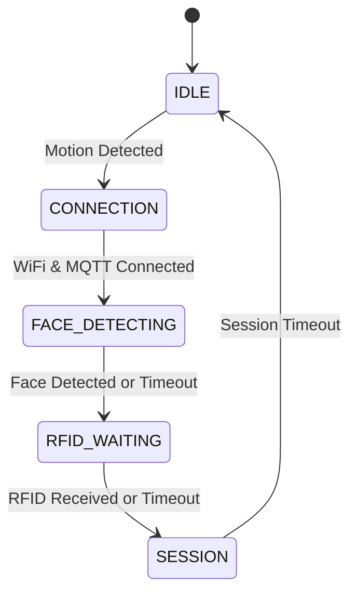
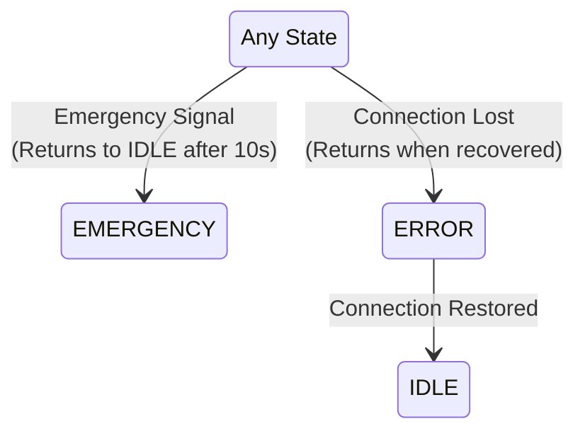

# 📜 ESP32-CAM — Core Responsibilities

## Responsibility 1: Trigger on Motion Detection 
- Monitor motion sensor (or simulate motion triggers)
- LED feedback: Normal blink during processing
- Transitions system to active state

## Responsibility 2: Face Detection and Image Capturing
- Perform face detection using lightweight algorithm
- Capture the image when face is detected
- Convert captured JPEG to Base64 for transmission
- Note: Currently capturing images on motion detection only. Face detection will be implemented in a future milestone.

## Responsibility 3: Session Management
- Generate unique session IDs
- Subscribe to `/rfid` channel for RFID data reception
- Combine face data with RFID status
- Create JSON payload with:
  - Session ID
  - Face data (Base64-encoded)
  - RFID status
  - Timestamp
  - Device identification
- Publish to MQTT channel `/session`
- LED feedback: Fast blink during active session

## Responsibility 4: Emergency Monitoring
- Monitor emergency channel via MQTT channel `/emergency`
- Immediate state transition on emergency
- Pause all face capture and session activities
- LED feedback: Solid ON during emergency
- Auto-return to IDLE after timeout (10 seconds)

## 🔄 State Machine Design

### Main Flow & Interrupt States

#### Normal Operation (Continuous Flow)

#### Interrupt Conditions (Updated)

### State Descriptions

#### IDLE State
- Low power mode
- Monitoring motion sensor only
- LED: OFF
- No WiFi or MQTT connections
- No image capture
- Transitions to CONNECTION on motion detection

#### CONNECTION State
- Motion detected, establishing connections
- Attempts WiFi connection
- Attempts MQTT connection after WiFi
- LED: Slow blink (1000ms)
- 5-second retry delay between attempts
- Transitions to FACE_DETECTING when connected
- Transitions to ERROR if connections fail

#### FACE_DETECTING State (Updated)
- WiFi and MQTT connected
- Camera active, performing face detection
- LED: Normal blink (500ms)
- 10-second timeout period
- Transitions to RFID_WAITING on face detection OR timeout
- Logs face detection status for API processing
- Continues flow regardless of detection result

#### RFID_WAITING State (Updated)
- Face detected or timeout occurred
- Listening on MQTT `/rfid` channel
- LED: Fast blink (200ms)
- 5-second timeout period
- Transitions to SESSION on RFID reception OR timeout
- Logs RFID detection status for API processing
- Continues flow regardless of detection result

#### SESSION State (Updated)
- Face and/or RFID detection status recorded
- Creating and sending session payloads
- Captures images every 3 seconds
- LED: Very fast blink (100ms)
- 3-second session timeout
- Transitions to IDLE on timeout
- Includes detection status in payload for API processing

#### EMERGENCY State
- All normal operations paused
- 10-second timeout period
- LED: Solid ON
- Auto-returns to IDLE after timeout

#### ERROR State
- Connection/hardware issue recovery
- Resets connection flags
- 5-second retry delay between attempts
- LED: Error pattern (very fast blink)
- Returns to IDLE when connections restored

## 🔌 Connection Details

### MQTT Configuration
- **Topics**:
  - `/session`: Session data publishing
  - Emergency channel monitoring (subscription)
  - `/rfid`: RFID data reception (subscription)

### Camera Configuration
- JPEG image capture
- Base64 encoding for transmission
- Face detection (Future implementation)

## 🛠️ Dependencies
- ESP32 Camera library
- PubSubClient (MQTT communication)
- ArduinoJson (JSON formatting)
- WiFi library
- Base64 library

## 💡 LED Status Indicators
- **OFF**: IDLE state
- **Slow Blink**: CONNECTION
- **Normal Blink**: FACE_DETECTING
- **Fast Blink**: RFID_WAITING
- **Very Fast Blink**: SESSION
- **Solid ON**: EMERGENCY state
- **Error Pattern**: ERROR state

## 🎯 Milestones & Progress

### Milestone 1: Basic Camera & State Management ✅ (Mar 2024)
- [x] Implement basic state machine
  - IDLE: Camera off, minimal power
  - CONNECTION: Establishing connections
  - FACE_DETECTING: Camera active, face detection
  - RFID_WAITING: Waiting for RFID
  - SESSION: Active session with image capture
  - EMERGENCY: System paused
  - ERROR: Connection/hardware issues
- [x] Configure camera module
  - Basic JPEG capture
  - Resolution settings (VGA)
  - Power management
- [x] Implement LED patterns for each state
  - IDLE: LED off
  - CONNECTION: Slow blink (1000ms)
  - FACE_DETECTING: Normal blink (500ms)
  - RFID_WAITING: Fast blink (200ms)
  - SESSION: Very fast blink (100ms)
  - EMERGENCY: Solid ON
  - ERROR: Error pattern

### Milestone 2: Motion Detection & State Transitions ✅ (Mar 2024)
- [x] Motion detection integration
  - Add motion sensor input
  - Implement debounce logic
  - State transition on motion
- [x] State transition handling
  - IDLE to CONNECTION on motion
  - CONNECTION to FACE_DETECTING on successful connection
  - FACE_DETECTING to RFID_WAITING on face detection
  - RFID_WAITING to SESSION on RFID reception
  - SESSION to IDLE on timeout
  - Error state handling

### Milestone 3: Communication & Session Management ✅ (Apr 2024)
- [x] WiFi and MQTT connection handling
  - Connect in CONNECTION state
  - Maintain in FACE_DETECTING and RFID_WAITING
  - Error handling and recovery
  - Add connection status guards
  - Implement graceful degradation
  - Handle partial connection loss
- [x] Session management
  - Generate unique session IDs
  - 3-second session timeout
  - Clean session termination
  - Add state cleanup functions
  - Implement session transition guards
  - Handle motion state during sessions
- [x] RFID integration
  - Listen for RFID messages
  - Validate RFID data
  - State transition on valid RFID
- [x] Image capture pipeline
  - Trigger on face detection
  - JPEG capture every 3 seconds
  - Memory management
  - Add resource cleanup
  - Implement memory monitoring
  - Handle camera resource allocation

### Milestone 4: Emergency & Error Handling ✅ (Apr 2024)
- [x] Emergency system integration
  - Monitor emergency MQTT channel
  - Immediate state transition
  - 10-second emergency timeout
  - Auto-return to IDLE
  - Add emergency state cleanup
  - Handle motion during emergency
  - Preserve previous state information
- [x] Error recovery system
  - Camera error detection
  - WiFi reconnection
  - MQTT reconnection
  - Memory overflow protection
  - Implement state transition guards
  - Add error state cleanup
  - Handle partial failures
- [x] System monitoring
  - Memory usage tracking
  - Connection status monitoring
  - Camera status checks
  - Temperature monitoring
  - Add resource management system
  - Implement health checks
  - Monitor state transitions

### Current Progress (April 2024):
- ✅ WiFi and MQTT connection established
- ✅ Basic state machine transitions working
- ✅ Session management implemented
  - Session cleanup on timeout
  - Resource monitoring
  - Enhanced session payload
  - Memory management
- ✅ RFID signal processing
- ✅ Image capture and publishing
- ✅ Emergency monitoring implemented
  - MQTT emergency channel subscription
  - Immediate state transition on emergency
  - Automatic timeout handling
  - State preservation
- 🔄 Testing and optimization

### Next Implementation Steps:
1. Convert to ESP-IDF framework
2. Add ESP-WHO face detection

### Milestone 5: Face Detection Integration 🔜 (Future)
- [ ] ESP-WHO integration
- [ ] Face detection implementation
  - Add face detection in FACE_DETECTING state
  - Only capture images when face detected
  - Improve image quality for face detection
- [ ] Performance optimization
- [ ] Integration with existing session management

### Milestone 6: ESP-IDF Framework Migration 🔜 (Future)
- [ ] Framework Transition
  - Set up ESP-IDF development environment
  - Create basic project structure
  - Implement FreeRTOS task management
  - Port existing state machine logic
- [ ] Component Migration
  - WiFi and MQTT using ESP-IDF APIs
  - Camera handling with ESP-IDF camera driver
  - GPIO and sensor management
  - Memory management optimization
- [ ] Performance Improvements
  - Implement proper task priorities
  - Add ESP-IDF event loop
  - Optimize power management
  - Enhance error handling
- [ ] Testing and Validation
  - Verify all state transitions
  - Test hardware interactions
  - Validate MQTT communication
  - Performance benchmarking

Note: This milestone depends on:
1. Completion of Milestone 3 (Communication & Session Management)
2. Completion of Milestone 5 (Face Detection Integration)

### Milestone 7: Multi-Session Management 🔜 (Future)
- [ ] Session grouping implementation
  - Add motion_id to session payload
  - Track related sessions
  - Maintain session counts
- [ ] Resource management
  - Implement session scheduling
  - Handle concurrent image captures
  - Memory optimization
- [ ] Enhanced state machine
  - Add SESSION_CREATING state
  - Modify SESSIONS state
  - Update state transitions
- [ ] API integration
  - Coordinate with API service updates
  - Implement new MQTT payload structure
  - Handle session grouping on device

Note: This milestone depends on:
1. Completion of Milestone 3 (Communication & Session Management)
2. Completion of Milestone 5 (Face Detection Integration)
3. API service updates for multi-session support
