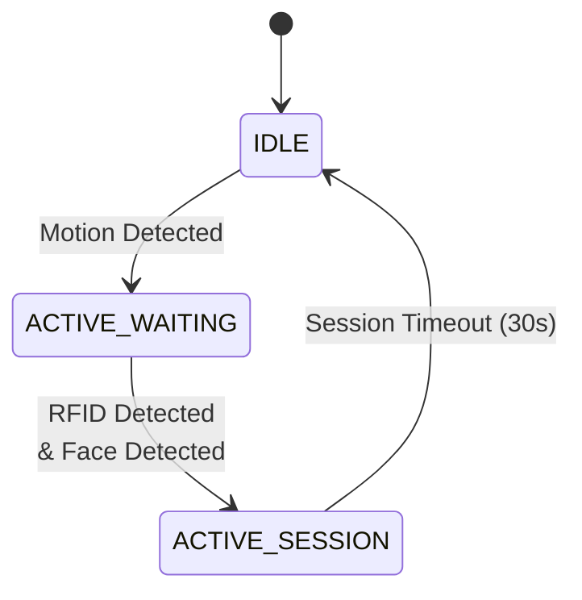
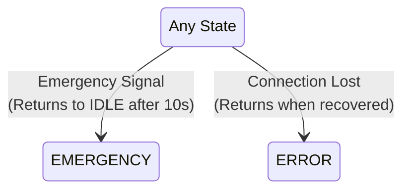

# 📜 ESP32-CAM — Core Responsibilities

## Responsibility 1: Motion Detection & Face Processing
- Monitor motion sensor (or simulate motion triggers)
- Capture images when motion is detected
- Perform face detection using lightweight algorithm
- Convert captured JPEG to Base64 for transmission
- Subscribe to `/rfid` channel for RFID data reception
- LED feedback: Normal blink during processing

## Responsibility 2: Session Management
- Generate unique session IDs
- Combine face data with RFID status
- Create JSON payload with:
  - Session ID
  - Face data (Base64-encoded)
  - RFID status
  - Timestamp
  - Device identification
- Publish to MQTT channel `/session`
- LED feedback: Fast blink during active session

## Responsibility 3: Emergency Monitoring
- Monitor emergency channel via MQTT channel `/emergency`
- Immediate state transition on emergency
- Pause all face capture and session activities
- LED feedback: Solid ON during emergency
- Auto-return to IDLE after timeout (10 seconds)

## 🔄 State Machine Design

### Main Flow & Interrupt States

#### Normal Operation

#### Interrupt Conditions

### State Descriptions

#### IDLE State
- Low power mode
- Monitoring motion sensor
- LED: OFF
- Actively monitoring emergency channel

#### ACTIVE_WAITING State
- Motion detected & system active
- Periodic image capture and face detection
- Listening for RFID signal via MQTT
- LED: Normal blink pattern

#### ACTIVE_SESSION State
- Face detected and RFID data received
- Session payload construction and publishing
- 30-second timeout monitoring
- LED: Fast blink pattern

#### EMERGENCY State
- All normal operations paused
- 10-second timeout period
- LED: Solid ON
- Auto-returns to IDLE after timeout

#### ERROR State
- Connection/hardware issue recovery
- LED: Error pattern (very fast blink)
- Automatic recovery attempts
- Returns to IDLE when resolved

## 🔌 Connection Details

### MQTT Configuration
- **Topics**:
  - `/session`: Session data publishing
  - Emergency channel monitoring (subscription)
  - `/rfid`: RFID data reception (subscription)

### Camera Configuration
- JPEG image capture
- Face detection enabled
- Base64 encoding for transmission

## 🛠️ Dependencies
- ESP32 Camera library
- PubSubClient (MQTT communication)
- ArduinoJson (JSON formatting)
- WiFi library
- Base64 library

## 💡 LED Status Indicators
- **OFF**: IDLE state
- **Normal Blink**: ACTIVE_WAITING
- **Fast Blink**: ACTIVE_SESSION
- **Solid ON**: EMERGENCY state
- **Very Fast Blink**: ERROR state

## 🎯 Milestones & Progress

### Milestone 1: Basic Camera & State Management ✅ (Mar 2024)
- [x] Implement basic state machine
  - IDLE: Camera off, minimal power
  - ACTIVE_WAITING: Camera on, ready for capture
  - ACTIVE_SESSION: Processing and sending image
  - EMERGENCY: System paused
  - ERROR: Connection/hardware issues
- [x] Configure camera module
  - Basic JPEG capture
  - Resolution settings (VGA)
  - Power management
- [x] Implement LED patterns for each state
  - IDLE: LED off
  - ACTIVE_WAITING: Normal blink (1000ms)
  - ACTIVE_SESSION: Fast blink (500ms)
  - EMERGENCY: Solid ON
  - ERROR: Very fast blink (200ms)
- [ ] Test state transitions
  - Manual triggers for testing
  - LED feedback verification
  - Power state verification

### Milestone 2: Communication Setup ✅ (Mar 2024)
- [x] WiFi connection management
  - Auto-connect on startup
  - Connection monitoring
  - Error state handling
- [x] MQTT connection setup
  - Broker connection with auto-reconnect
  - Topic subscriptions
  - Error handling
- [x] Basic message handling
  - Subscribe to `/rfid` channel
  - Subscribe to emergency channel
  - Message parsing with ArduinoJson
- [x] Implement retry mechanism
  - Max 3 retry attempts for MQTT publish
  - Backoff delay between retries
  - Return to IDLE on persistent failure

### Milestone 3: Image Capture & Transmission ⏳ (Apr 2024)
- [ ] Basic image capture pipeline
  - Trigger on state change
  - JPEG capture
  - Memory management
- [ ] Base64 encoding
  - Convert JPEG to Base64
  - Optimize memory usage
  - Test with different image sizes
- [ ] MQTT image transmission
  - Create JSON payload structure
  - Include metadata (timestamp, device ID)
  - Implement chunked transmission if needed
- [ ] Session management
  - Generate unique session IDs
  - 10-second session timeout
  - Clean session termination

### Milestone 4: Emergency & Error Handling 🔄 (Apr 2024)
- [ ] Emergency system integration
  - Monitor emergency MQTT channel
  - Immediate state transition
  - 10-second emergency timeout
  - Auto-return to IDLE
- [ ] Error recovery system
  - Camera error detection
  - WiFi reconnection
  - MQTT reconnection
  - Memory overflow protection
- [ ] System monitoring
  - Memory usage tracking
  - Connection status monitoring
  - Camera status checks
  - Temperature monitoring

### Milestone 5: Face Detection Integration 🔜 (Future)
- [ ] Transition to ESP-IDF framework
- [ ] ESP-WHO integration
- [ ] Face detection implementation
- [ ] Performance optimization
- [ ] Integration with existing session management

### Current Focus (March 2024):
1. Implementing image capture and processing
2. Setting up Base64 encoding for image transmission
3. Testing MQTT message handling with actual hardware
4. Implementing session management

### Next Steps:
1. Implement image capture functionality
2. Add Base64 encoding for image transmission
3. Create session management system
4. Test end-to-end communication flow