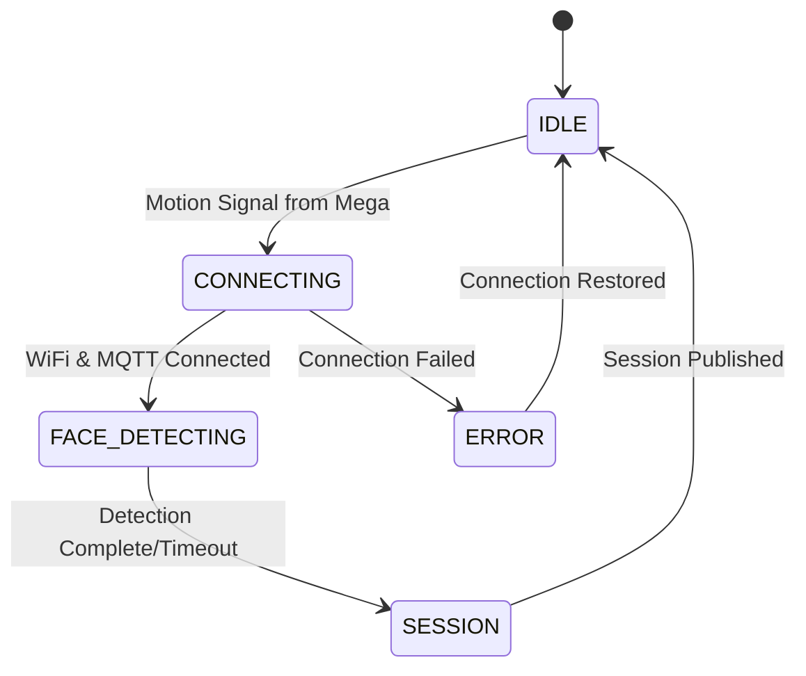
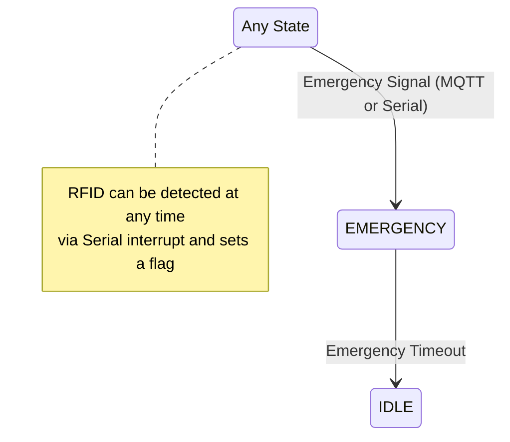

# 📜 ESP32-CAM — Core Responsibilities

## Responsibility 1: Trigger on Motion Signal from Arduino Mega
- Receive motion signal from Arduino Mega via Serial communication.
- LED feedback: Normal blink during processing
- Transitions system to active state (CONNECTING)

## Responsibility 2: Face Detection and Image Capturing
- Attempts face detection using EloquentEsp32cam library.
- Captures an image regardless of whether a face was successfully detected.
- Converts the captured JPEG image to Base64 for transmission.

## Responsibility 3: Session Management
- Generate unique session IDs.
- Monitor for RFID signal from Arduino Mega via Serial (interrupt-style).
- Create JSON payload including:
  - Session ID
  - Image data (Base64-encoded) - *Always sent if image capture is successful.*
  - `face_detected` status (boolean) - *Indicates if a face was found in the sent image.*
  - `rfid_detected` status (boolean) - *Based on signal from Mega.*
  - Timestamp
  - Device identification
- Publish payload to MQTT channel `campus/security/session`.
- LED feedback: Fast blink during active session.

## Responsibility 4: Emergency Monitoring
- Monitor emergency channel via MQTT channel `/emergency` AND via Serial from Mega
- Immediate state transition on emergency
- Pause all face capture and session activities
- LED feedback: Solid ON during emergency
- Auto-return to IDLE after timeout

## 🔄 Serial Communication Protocol

The ESP32-CAM receives signals from the Arduino Mega through a simple Serial protocol:

```
<START><COMMAND><DATA><END>
```

Where:
- `<START>` is a character like '$'
- `<COMMAND>` is a single character:
  - 'M' for motion detected
  - 'R' for RFID detected
  - 'E' for emergency
- `<DATA>` is optional data (like RFID tag value)
- `<END>` is a character like '#'

Examples:
- `$M#` = Motion detected
- `$R1234567890#` = RFID detected with tag 1234567890
- `$E#` = Emergency

## 🔄 Revised State Machine Design

### Main Flow & Interrupt States

#### Normal Operation (Simplified Flow)


#### Interrupt Conditions


### State Descriptions

#### IDLE State
- Low power mode
- Monitoring Serial for motion signal from Arduino Mega
- LED: OFF
- No WiFi or MQTT connections (connects only after motion detected)
- No image capture
- Transitions to CONNECTING on receiving motion signal from Mega

#### CONNECTING State
- Motion signal received, establishing connections
- Attempts WiFi connection
- Attempts MQTT connection after WiFi
- LED: Slow blink (1000ms)
- 5-second retry delay between attempts
- Transitions to FACE_DETECTING when connected
- Transitions to ERROR if connections fail

#### FACE_DETECTING State
- WiFi and MQTT connected
- Camera active, attempts face detection
- LED: Normal blink (500ms)
- Always captures an image regardless of detection result
- Sets face_detected flag based on detection result
- Transitions to SESSION after detection attempt (regardless of success)

#### SESSION State
- Face detection status (`true`/`false`) recorded
- RFID detection status checked (can be set at any time via Serial)
- Creates the JSON payload, including:
  - image data (Base64)
  - face_detected flag
  - rfid_detected flag
  - rfid_tag (if available)
- Publishes the payload to `campus/security/session`
- LED: Very fast blink (100ms)
- Transitions to IDLE when complete

#### EMERGENCY State
- All normal operations paused
- 10-second timeout period
- LED: Solid ON
- Auto-returns to IDLE after timeout

#### ERROR State
- Connection/hardware issue recovery
- 5-second retry delay between attempts
- LED: Error pattern (very fast blink)
- Returns to IDLE when connections restored

## 🔌 Connection Details

### MQTT Configuration
- **Topics**:
  - `campus/security/session`: Session data publishing
  - `campus/security/emergency`: Emergency channel monitoring (subscription)

### Serial Communication
- **Baud Rate**: 115200
- **Pins**: TX (pin 6), RX (pin 7)
- **Protocol**: Custom message format as described above

## 🛠️ Dependencies
- EloquentEsp32cam library (camera management and face detection)
- PubSubClient (MQTT communication)
- ArduinoJson (JSON formatting)
- WiFi library
- Base64 library

## 💡 LED Status Indicators
- **OFF**: IDLE state
- **Slow Blink**: CONNECTING
- **Normal Blink**: FACE_DETECTING
- **Very Fast Blink**: SESSION
- **Solid ON**: EMERGENCY state
- **Error Pattern**: ERROR state

# ESP32-CAM Firmware Implementation Plan

## 1. Development Framework: Arduino & PlatformIO

This firmware utilizes the **Arduino framework** for the ESP32, with development managed using **PlatformIO**. Key components:

- **EloquentEsp32cam**: For camera initialization, frame capture, and face detection
- **PubSubClient**: For MQTT communication
- **WiFi**: For network connectivity
- **ArduinoJson**: For creating the MQTT session payload
- **Base64**: For encoding image data

## 2. Revised Development Plan

### Phase 1: Serial Communication Implementation
- **Goal:** Implement the serial protocol for receiving signals from Arduino Mega
- **Tasks:**
  - [x] Create a serial_handler module with functions for parsing the protocol
  - [x] Set up Serial1 for communication with Arduino Mega (Note: README mentions Serial2/pins 6,7; Code uses Serial1/pins 13,12)
  - [x] Implement command parsing for motion ('M'), RFID ('R'), and emergency ('E') signals
  - [x] Create global flags for motion_detected, rfid_detected, and emergency_triggered
  - [x] Add RFID tag storage when received

### Phase 2: State Machine Revision
- **Goal:** Update the state machine to the simplified flow with interrupt-style RFID handling
- **Tasks:**
  - [x] Remove RFID_WAITING state from enum definition (Achieved by implementing the new state machine)
  - [x] Update handleIdleState() to transition based on serial motion detection
  - [x] Modify handleFaceDetectingState() to transition directly to SESSION
  - [x] Update handleSessionState() to use the rfid_detected flag from serial handler
  - [x] Refactor handleEmergencyState() to handle serial emergency signals (MQTT handling separate)

### Phase 3: Face Detection Integration
- **Goal:** Ensure reliable face detection and image capture with EloquentEsp32cam
- **Tasks:**
  - [x] Verify setupCamera() correctly initializes EloquentEsp32cam
  - [ ] Optimize face detection parameters (confidence threshold, etc.)
  - [x] Ensure image capture always occurs regardless of face detection result
  - [x] Set face_detected flag correctly based on detection.found()
  - [x] Log detailed detection results for debugging

### Phase 4: Session Payload Construction
- **Goal:** Create the correct JSON payload with all required fields
- **Tasks:**
  - [x] Update `handleSessionState()` to create and publish the JSON payload (Initial implementation complete)
  - [x] Include rfid_tag in payload logic (checked in placeholder)
  - [x] Ensure image data is always included when camera capture succeeds (Image data accessed and encoded)
  - [x] Add session_duration calculation (logged in placeholder)
  - [ ] Verify payload structure matches the Pydantic model requirements (e.g., UUID, ISO timestamp)

### Phase 5: Testing & Reliability
- **Goal:** Ensure the system works reliably with the Arduino Mega
- **Tasks:**
  - [ ] Create test sequences for the Arduino Mega to send different serial commands
  - [ ] Test the full flow with simulated inputs
  - [ ] Implement error recovery for serial communication issues
  - [ ] Add detailed logging for troubleshooting
  - [ ] Optimize timeouts and retry mechanisms

## 3. Implementation Approach

1. **Modular Structure:**
   - Separate modules for WiFi, MQTT, LED control, camera, and serial handling
   - Clear state machine implementation in main.cpp

2. **Connect-on-demand Network:**
   - WiFi and MQTT connections are only established after motion detection
   - No network connections during IDLE state to conserve power
   - Full disconnect when returning to IDLE state

3. **Interrupt-Style Handling:**
   - Serial parsing runs in the background (via serialEvent or in loop)
   - Sets flags that are checked in appropriate states
   - RFID detection can occur at any time and is recorded for the SESSION state

4. **Always Capture Image:**
   - Always capture image in FACE_DETECTING state
   - Record face detection result as a boolean flag
   - Include image in session payload regardless of detection result

5. **Robust Communication:**
   - Use checksums or start/end markers in serial protocol
   - Add error handling and recovery for network issues
   - Implement reconnection logic for both WiFi and MQTT
