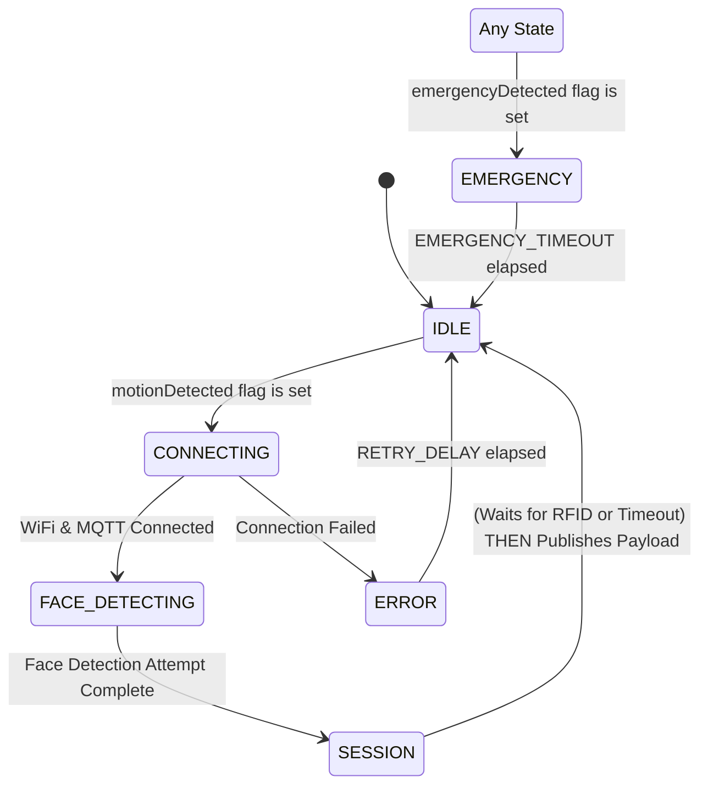

# 📜 ESP32-CAM — Core Responsibilities

## Responsibility 1: Trigger on Motion Signal from Arduino Mega
- Receive motion signal (`M`) from Arduino Mega via Serial communication (handled by `serial_handler`).
- Sets `motionDetected` flag.
- Main loop uses this flag to transition system from `IDLE` to active state (`CONNECTING`).

## Responsibility 2: Face Detection and Image Capturing
- Attempts face detection using EloquentEsp32cam library during `FACE_DETECTING` state.
- Captures an image regardless of whether a face was successfully detected.
- Stores the face detection result (`true`/`false`) locally for the current session.
- Converts the captured JPEG image to Base64 for transmission.

## Responsibility 3: Session Management & RFID Handling
- Generate unique session IDs.
- Continuously monitors for RFID (`R`+tag) and Emergency (`E`) signals from Arduino Mega via Serial (handled by `serial_handler`).
- Sets `rfidDetected` flag and stores tag in `rfidTag` buffer.
- In `SESSION` state:
    - Checks if `rfidDetected` flag is set.
    - If not set, waits up to `RFID_WAIT_TIMEOUT_MS` for the flag to become set.
    - Creates JSON payload including:
  - Session ID
  - Image data (Base64-encoded) - *Always sent if image capture is successful.*
      - `face_detected` status (boolean) - *Result from the face detection step.*
      - `rfid_detected` status (boolean) - *Value of the flag when payload is created.*
      - `rfid_tag` (string) - *Included only if `rfidDetected` was true.*
      - Timestamp, Device ID, etc.
- Publishes payload to MQTT channel `campus/security/session`.

## Responsibility 4: Emergency Monitoring
- Monitors for emergency signal (`E`) via Serial from Mega (handled by `serial_handler`).
- Sets `emergencyDetected` flag.
- Main loop checks this flag and transitions to `EMERGENCY` state if set (unless already in `EMERGENCY`).
- Emergency state pauses normal operations.
- Auto-return to `IDLE` after `EMERGENCY_TIMEOUT`.

## 🔄 Serial Communication Protocol

The ESP32-CAM receives signals from the Arduino Mega through a simple Serial protocol handled by `serial_handler.cpp`. Messages are framed using '<' as the start character and '>' as the end character.

Key commands expected (content between '<' and '>'):
- `M`: Motion detected
- `E`: Emergency detected
- `R[tag_data]`: RFID detected, followed immediately by the tag data.

Examples of complete framed messages sent by Mega:
- `<M>`
- `<E>`
- `<R123ABCXYZ>`

`serial_handler` parses the content within the frame, sets boolean flags (`motionDetected`, `rfidDetected`, `emergencyDetected`), and populates the `rfidTag` buffer, which are accessed by `main.cpp`.

## 🔄 State Machine Flow

### State Descriptions

*   **IDLE:** Low power. Monitors `motionDetected` flag. Clears all flags on exit from other states returning here.
*   **CONNECTING:** Connects to WiFi, then MQTT. Retries on failure.
*   **FACE_DETECTING:** Captures image, attempts face detection. Stores result locally.
*   **SESSION:** Checks `rfidDetected`. Waits up to `RFID_WAIT_TIMEOUT_MS` if false. Builds JSON payload (including RFID tag if `rfidDetected` is true). Publishes payload. Transitions to `IDLE`.
*   **EMERGENCY:** Entered if `emergencyDetected` flag is set. Pauses operations. Returns to `IDLE` after timeout.
*   **ERROR:** Handles connection or hardware failures. Retries/returns to `IDLE` after delay.

## 🔌 Connection Details

### MQTT Configuration
- **Topics**:
  - `campus/security/session`: Session data publishing
  - *(MQTT emergency subscription might be removed if only relying on Serial 'E')*

### Serial Communication (with Mega)
- **Handler:** `serial_handler.cpp`
- **Pins:** Defined in `config.h` (`SERIAL_RX_PIN = 19`, `SERIAL_TX_PIN = 18` using `SerialPort(1)` which maps to UART1)
- **Baud Rate**: Defined in `config.h` (`SERIAL_BAUD_RATE`)
- **Protocol**: Framed messages `<M>`, `<E>`, `<R[tag]>`

## 🛠️ Dependencies
- EloquentEsp32cam library
- PubSubClient
- ArduinoJson
- WiFi library
- Base64 library

## 💡 LED Status Indicators
- (Update if changed from previous description)

## 🧪 Testing

PlatformIO environments are configured for various tests located in `src/tests/`:

*   **Unit Tests (`src/tests/unit/`)**
    *   `test_serial_input_e`: Tests receiving 'E' command (basic serial check).
    *   `test_serial_input_rfid`: Tests receiving 'R'+tag command (basic serial check).
    *   `test_unit_face_detection`: Initializes camera, connects WiFi/MQTT, runs one face detection, publishes result to MQTT.
*   **Integration Tests (`src/tests/integration/`)**
    *   `test_serial_input_rfid_to_session`: Simulates receiving 'M' then 'R'+tag, verifies flags/tag buffer are set correctly by `serial_handler` logic.

*(Add other tests as needed)*

## Iterative Development & Testing Plan (Serial Handling & Core Logic)

This plan outlines the steps to incrementally build and test the ESP32's functionality, starting from basic serial reception.

**Goal:** Ensure reliable serial communication from the Arduino Mega and integrate it with the ESP32's state machine and core tasks.

**Prerequisites:**
*   Arduino Mega running a reliable sender sketch (e.g., `ArduinoMega/src/tests/integration/test_rfid_input_to_serial2.cpp` sending `<M>`, `<R[tag]>`, `<E>`).
*   Correct physical wiring (TX-RX, RX-TX, **Common Ground**, **Logic Level Shifter** strongly recommended).
*   PlatformIO environment set up for ESP32-WROVER.

**Steps:**

[X]  **`<...>` Frame Detection & Echo**
    *   **Goal:** Implement and test the logic to detect and buffer characters only between `<` and `>`.
    *   **Action:** Create a new test sketch (e.g., `ESP32-WROVER/src/tests/test_serial_frame_echo.cpp`). Adapt the core logic from `serial_handler.cpp` (`isUsefulChar`, `messageStarted`, `serialBuffer`, `START_CHAR`, `END_CHAR`, correct `HardwareSerial` pins/baud). When a complete frame (`>` received while `messageStarted`) is detected, print the entire received frame (e.g., "Received frame: `<M>`" or "Received frame: `<RFAKE123>`"). Do *not* parse the command yet. Initialize `HardwareSerial` correctly within this test sketch.
    *   **Test:** Use the Mega sender (`test_rfid_input_to_serial2.cpp`). Verify that the ESP32 correctly prints the complete frames `<M>`, `<RFAKE123>`, and `<E>`. Test edge cases (e.g., sending garbage outside frames, sending incomplete frames).

[X]  **Command Parsing & Flag Setting**
    *   **Goal:** Parse the content within valid frames and set corresponding boolean flags.
    *   **Action:** Enhance the test sketch from Step 1. Integrate the `parseSerialMessage` function logic. When a valid frame is received, call `parseSerialMessage`. Inside `parseSerialMessage`, set global boolean flags (`motionDetected`, `rfidDetected`, `emergencyDetected`) and copy the tag to `rfidTag`. Print confirmations (e.g., "Parsed MOTION command, flag set", "Parsed RFID command, tag: [tag], flag set"). Add a way to clear flags in the loop for repeated testing.
    *   **Test:** Use the Mega sender. Verify the correct flags are set and the RFID tag is extracted accurately based on the serial monitor output. Check that flags are cleared appropriately.
    *   **Status: COMPLETED** - Verified working in `test_serial_frame_echo.cpp`.

[ ]  **Introduce Minimal State Machine (Idle -> Action)**
    *   **Goal:** Integrate the basic state concept (`IDLE`) and react to a parsed command.
    *   **Action:** Enhance the test sketch from Step 2. Introduce a simple `currentState` variable (initially `IDLE`). In the loop, if `currentState == IDLE` and `motionDetected` (set in Step 2) is true, print "Motion detected, taking action..." and maybe transition to a dummy `ACTION` state. Reset `motionDetected`.
    *   **Test:** Send `<M>` from the Mega. Verify the ESP32 prints the "Motion detected..." message.

[ ]  **Integrate RFID & Emergency Logic**
    *   **Goal:** Add handling for RFID and Emergency flags within a basic state context.
    *   **Action:** Expand the test sketch from Step 3. If an `ACTION` state is reached, check for `rfidDetected` and print the tag if found. Independently, check for `emergencyDetected` at the top level of the loop and print an "EMERGENCY DETECTED" message if true. Clear flags after processing.
    *   **Test:** Send `<M>`, then `<R...>`, then `<E>`. Verify the corresponding actions/messages occur on the ESP32 monitor.

[ ]  **Gradual Integration with `main.cpp`**
    *   **Goal:** Integrate the now-tested serial handling logic back into the full `main.cpp` application.
    *   **Action:** Carefully merge the tested and refined logic back into the main project's `serial_handler.cpp` and `main.cpp`. Re-enable other components (WiFi, MQTT, Camera, LED states) one by one, testing thoroughly after each addition to ensure serial handling isn't broken. Pay close attention to loop timing and state interactions.
    *   **Test:** Retest the full sequence (`<M>`, `<R...>`, `<E>`) and verify the complete application state machine transitions and performs actions as expected.

