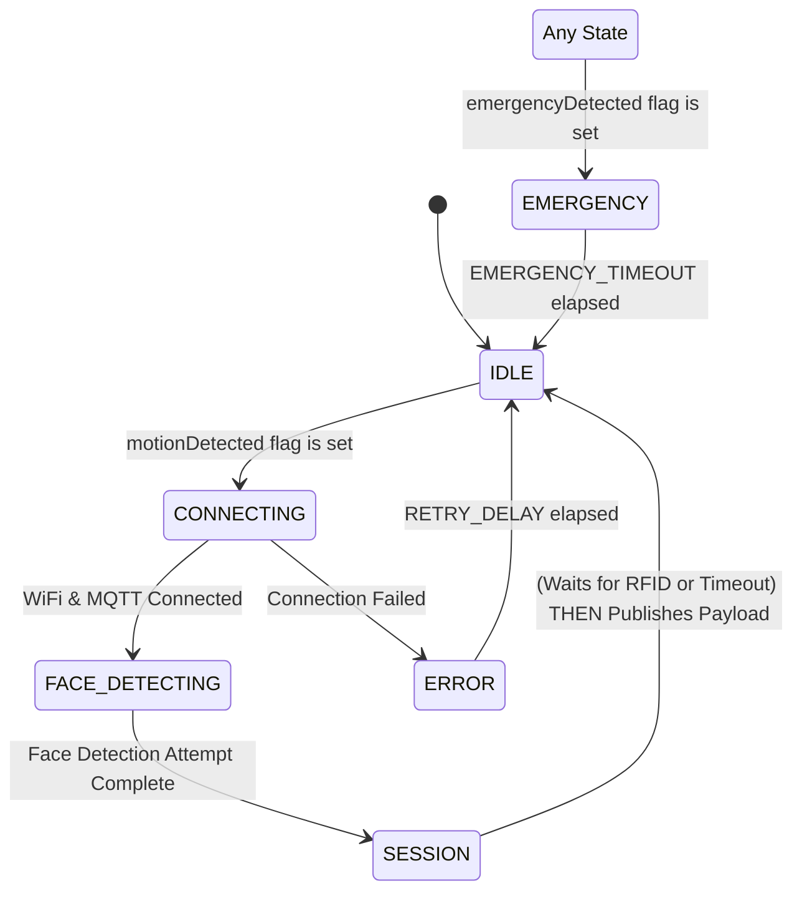

# 📜 ESP32-CAM — Core Responsibilities

## Responsibility 1: Trigger on Motion Signal from Arduino Mega
- Receive motion signal (`M`) from Arduino Mega via Serial communication (handled by `serial_handler`).
- Sets `motionDetected` flag.
- Main loop uses this flag to transition system from `IDLE` to active state (`CONNECTING`).

## Responsibility 2: Face Detection and Image Capturing
- Attempts face detection using EloquentEsp32cam library during `FACE_DETECTING` state.
- Captures an image regardless of whether a face was successfully detected.
- Stores the face detection result (`true`/`false`) locally for the current session.
- Converts the captured JPEG image to Base64 for transmission.

## Responsibility 3: Session Management & RFID Handling
- Generate unique session IDs.
- Continuously monitors for RFID (`R`+tag) and Emergency (`E`) signals from Arduino Mega via Serial (handled by `serial_handler`).
- Sets `rfidDetected` flag and stores tag in `rfidTag` buffer.
- In `SESSION` state:
    - Checks if `rfidDetected` flag is set.
    - If not set, waits up to `RFID_WAIT_TIMEOUT_MS` for the flag to become set.
    - Creates JSON payload including:
  - Session ID
  - Image data (Base64-encoded) - *Always sent if image capture is successful.*
      - `face_detected` status (boolean) - *Result from the face detection step.*
      - `rfid_detected` status (boolean) - *Value of the flag when payload is created.*
      - `rfid_tag` (string) - *Included only if `rfidDetected` was true.*
      - Timestamp, Device ID, etc.
- Publishes payload to MQTT channel `campus/security/session`.

## Responsibility 4: Emergency Monitoring
- Monitors for emergency signal (`E`) via Serial from Mega (handled by `serial_handler`).
- Sets `emergencyDetected` flag.
- Main loop checks this flag and transitions to `EMERGENCY` state if set (unless already in `EMERGENCY`).
- Emergency state pauses normal operations.
- Auto-return to `IDLE` after `EMERGENCY_TIMEOUT`.

## 🔄 Serial Communication Protocol

The ESP32-CAM receives signals from the Arduino Mega through a simple Serial protocol handled by `serial_handler.cpp`. Messages are framed using '<' as the start character and '>' as the end character.

Key commands expected (content between '<' and '>'):
- `M`: Motion detected
- `E`: Emergency detected
- `R[tag_data]`: RFID detected, followed immediately by the tag data.

Examples of complete framed messages sent by Mega:
- `<M>`
- `<E>`
- `<R123ABCXYZ>`

`serial_handler` parses the content within the frame, sets boolean flags (`motionDetected`, `rfidDetected`, `emergencyDetected`), and populates the `rfidTag` buffer, which are accessed by `main.cpp`.

## 🔄 State Machine Flow



### State Descriptions

*   **IDLE:** Low power. Monitors `motionDetected` flag. Clears all flags on exit from other states returning here.
*   **CONNECTING:** Connects to WiFi, then MQTT. Retries on failure.
*   **FACE_DETECTING:** Captures image, attempts face detection. Stores result locally.
*   **SESSION:** Checks `rfidDetected`. Waits up to `RFID_WAIT_TIMEOUT_MS` if false. Builds JSON payload (including RFID tag if `rfidDetected` is true). Publishes payload. Transitions to `IDLE`.
*   **EMERGENCY:** Entered if `emergencyDetected` flag is set. Pauses operations. Returns to `IDLE` after timeout.
*   **ERROR:** Handles connection or hardware failures. Retries/returns to `IDLE` after delay.

## 🔌 Connection Details

### MQTT Configuration
- **Topics**:
  - `campus/security/session`: Session data publishing
  - *(MQTT emergency subscription might be removed if only relying on Serial 'E')*

### Serial Communication (with Mega)
- **Handler:** `serial_handler.cpp`
- **Pins:** Defined in `config.h` (`SERIAL_RX_PIN = 19`, `SERIAL_TX_PIN = 18` using `SerialPort(1)` which maps to UART1)
- **Baud Rate**: Defined in `config.h` (`SERIAL_BAUD_RATE`)
- **Protocol**: Framed messages `<M>`, `<E>`, `<R[tag]>`

## 🛠️ Dependencies
- EloquentEsp32cam library
- PubSubClient
- ArduinoJson
- WiFi library
- Base64 library

## 💡 LED Status Indicators
- (Update if changed from previous description)

## 🧪 Testing

PlatformIO environments are configured for various tests located in `src/tests/`:

*   **Unit Tests (`src/tests/unit/`)**
    *   `test_serial_input_e`: Tests receiving 'E' command (basic serial check).
    *   `test_serial_input_rfid`: Tests receiving 'R'+tag command (basic serial check).
    *   `test_unit_face_detection`: Initializes camera, connects WiFi/MQTT, runs one face detection, publishes result to MQTT.
*   **Integration Tests (`src/tests/integration/`)**
    *   `test_serial_input_rfid_to_session`: Simulates receiving 'M' then 'R'+tag, verifies flags/tag buffer are set correctly by `serial_handler` logic.

*(Add other tests as needed)*

## Iterative Testing: GPIO Signaling & Application Logic (Using Voltage Dividers)

This plan outlines steps to test using direct GPIO signaling between the Mega and ESP32, triggering ESP32 actions based on these signals. This replaces previous UART communication plans.

**Goal:** Have the Mega signal Motion and RFID detection events to the ESP32 via GPIO pins (using voltage dividers for level translation), triggering the ESP32's state machine and using a hardcoded RFID tag.

**Hardware Assumptions:**
*   ESP32 and Mega share a **Common Ground**.
*   **Voltage Dividers** are correctly wired and calculated to step down the 5V HIGH signal from the Mega output pins to a safe 3.3V level for the ESP32 input pins:
    *   Mega GPIO Pin 8 (Output, 5V Logic) -> Voltage Divider -> ESP32 GPIO Pin 18 (Input, 3.3V Logic) [Motion Signal]
    *   Mega GPIO Pin 9 (Output, 5V Logic) -> Voltage Divider -> ESP32 GPIO Pin 19 (Input, 3.3V Logic) [RFID Signal]
*   (Optional: Define pins for Emergency signal if needed).
*   **Note on Voltage Dividers:** While voltage dividers protect the ESP32 input pins from overvoltage, they can be more susceptible to noise pickup and signal edge degradation compared to active logic level shifter ICs, especially in electrically noisy environments (like when the camera is active). Signal integrity should be monitored.

**ESP32 Pin Configuration Note:** ESP32 input pins (18, 19) should be configured with `INPUT_PULLDOWN` to ensure a defined LOW state when the Mega is not sending a HIGH signal (outputting 0V, which the divider translates to 0V).

**Test Steps:**

[X]  **(Signal Test A) Mega -> ESP32 Motion Signal (via Divider):**
    *   **Goal:** Verify Mega Pin 8 can reliably signal HIGH (translated to ~3.3V by divider) to ESP32 Pin 18.
    *   **Mega Sketch (`test_mega_tx_gpio_motion.cpp`):**
        *   Configure Pin 8 as `OUTPUT`.
        *   In `loop()`, toggle Pin 8 HIGH/LOW periodically (e.g., every 2 seconds), printing state to Mega Serial Monitor.
    *   **ESP32 Sketch (`test_esp_rx_gpio_motion.cpp`):**
        *   Configure Pin 18 as `INPUT_PULLDOWN` in `setup()`.
        *   In `loop()`, read `digitalRead(18)`. Print "Motion Signal HIGH" or "Motion Signal LOW" to ESP32 Serial Monitor when the state changes.
    *   **Test:** Verify ESP32 prints correspond correctly to Mega's Pin 8 state changes. Check signal stability, especially for clean transitions.

[X]  **(Signal Test B) Mega -> ESP32 RFID Signal (via Divider):**
    *   **Goal:** Verify Mega Pin 9 can reliably signal HIGH (translated to ~3.3V by divider) to ESP32 Pin 19.
    *   **Mega Sketch (`test_mega_tx_gpio_rfid.cpp`):**
        *   Configure Pin 9 as `OUTPUT`.
        *   In `loop()`, toggle Pin 9 HIGH/LOW periodically (e.g., every 2 seconds), printing state to Mega Serial Monitor.
    *   **ESP32 Sketch (`test_esp_rx_gpio_rfid.cpp`):**
        *   Configure Pin 19 as `INPUT_PULLDOWN` in `setup()`.
        *   In `loop()`, read `digitalRead(19)`. Print "RFID Signal HIGH" or "RFID Signal LOW" to ESP32 Serial Monitor when the state changes.
    *   **Test:** Verify ESP32 prints correspond correctly to Mega's Pin 9 state changes. Check signal stability.

[X]  **(Integration Test) GPIO Trigger -> ESP32 Flags & State:**
    *   **Goal:** Trigger ESP32 state transitions and flag setting using GPIO signals received via voltage dividers.
    *   **ESP32 Sketch (`test_esp_gpio_state_machine.cpp`):**
        *   Combine receiver logic. Configure Pins 18 & 19 as `INPUT_PULLDOWN`.
        *   Define `motionDetected`, `rfidDetected` flags and `rfidTag` buffer. Define `IDLE`/`ACTION` states. Use a hardcoded RFID tag (e.g., `FAKE123`).
        *   In `loop()`:
            *   Read Pin 18. If HIGH, set `motionDetected = true`.
            *   Read Pin 19. If HIGH, set `rfidDetected = true`, copy hardcoded tag to `rfidTag`.
            *   Implement state logic: If `currentState == IDLE` and `motionDetected`, print msg, transition to `ACTION`, clear `motionDetected`.
            *   If `currentState == ACTION` and `rfidDetected`, print RFID message (using hardcoded tag), clear `rfidDetected`.
    *   **Mega Sketch:** Use toggle sketches from Steps 1 & 2, or manually trigger HIGH on Pin 8, then Pin 9.
    *   **Test:** Verify state transition occurs on Pin 18 HIGH. Verify RFID flag/tag set on Pin 19 HIGH and processed correctly in `ACTION` state.

4.  **(Full Integration) GPIO Input in `main.cpp`:**
    *   **Goal:** Replace UART handling with direct GPIO reads (via voltage dividers) in the main application.
    *   **Action:**
        *   Remove/comment out `#include "serial_handler/serial_handler.h"` and the call to `setupSerialHandler()` in `main.cpp`.
        *   In `main.cpp`'s `setup()`, add `pinMode(18, INPUT_PULLDOWN);` and `pinMode(19, INPUT_PULLDOWN);`.
        *   Remove the call to `processSerialData()` from `main.cpp`'s `loop()`.
        *   Add direct reads within the main `loop()` (before the state machine switch):
            ```cpp
            // --- GPIO Signal Handling ---
            bool motionSignal = (digitalRead(18) == HIGH);
            bool rfidSignal = (digitalRead(19) == HIGH);

            // Optional basic debouncing / edge detection could be added here if needed

            if (motionSignal) {
                motionDetected = true; // Flag will be cleared by state machine logic
            }

            if (rfidSignal) {
                if (!rfidDetected) { // Trigger only once while signal is HIGH
                   rfidDetected = true;
                   strcpy(rfidTag, "FAKE123"); // Use defined fake tag
                   Serial.println("-> RFID Signal HIGH detected.");
                }
            } else {
                 // If signal goes LOW, allow rfidDetected to be set again next time
                 // Depending on Mega logic, rfidDetected might need explicit clearing elsewhere
            }
            // --- End GPIO Signal Handling ---
            ```
        *   Re-enable `setupCamera()` etc. in `main.cpp`.
    *   **Test:** Verify the entire application flow works, triggered by HIGH signals on pins 18 and 19 from the Mega. Test interaction with camera initialization noise – observe if GPIO signals are still reliably detected when the camera is active.

---

