# Campus Security and Evacuation System (CSES) - Integrated RFID & Facial Recognition Security System 🏢🔐

**CSES** is an integrated security system designed to enhance campus safety using **RFID authentication**, **facial recognition**, and **real-time monitoring**. It combines hardware components like Arduino, ESP32-CAM, and various sensors with a robust backend system to provide layered access control and emergency response capabilities.

<!-- Add GIF/Screenshot of system in action -->

## 📑 Table of Contents

- [Campus Security and Evacuation System (CSES) - Integrated RFID \& Facial Recognition Security System 🏢🔐](#campus-security-and-evacuation-system-cses---integrated-rfid--facial-recognition-security-system-)
  - [📑 Table of Contents](#-table-of-contents)
  - [🚀 Features](#-features)
  - [🛠️ Tech Stack](#️-tech-stack)
  - [Design Decisions \& Limitations](#design-decisions--limitations)
  - [🛠️ Getting Started](#️-getting-started)
    - [📋 Prerequisites](#-prerequisites)
    - [⚙️ Configuration](#️-configuration)
    - [💻 Software Setup (Backend Services)](#-software-setup-backend-services)
    - [🔌 Hardware Setup (Flashing Microcontrollers)](#-hardware-setup-flashing-microcontrollers)
    - [🧪 Running Tests](#-running-tests)
    - [🚀 Launching the System](#-launching-the-system)
  - [❓ Troubleshooting](#-troubleshooting)
  - [⚡ Quick Start](#-quick-start)
  - [Demo](#demo)
- [Documentation](#documentation)
  - [System Architecture](#system-architecture)
  - [Code Structure](#code-structure)

## 🚀 Features

*   🔐 **Dual Authentication:** Combines RFID tag scanning with facial recognition for robust access control.
*   📷 **Facial Recognition:** Utilizes an ESP32-CAM and a backend DeepFace service to verify identities against an authorized database.
*   💳 **RFID Access:** Uses SmartRF06 boards (or similar) for RFID tag-based entry.
*   🏃 **Motion Detection:** RCWL-0516 sensors trigger camera activation upon detecting movement.
*   🚨 **Emergency Override:** Includes a physical pull station (MS-7) to unlock doors and trigger visual alerts (strobe light) during emergencies.
*   🚪 **Servo-Controlled Lock:** A dedicated servo motor manages the physical door locking mechanism.
*   🌐 **Web Dashboard:** A Flask-based web interface for administrators to monitor access logs, review pending entries, and manage employee data. <!-- Add screenshot of Admin Dashboard -->
*   🔔 **Real-time Notifications:** Sends alerts via Twilio or Ntfy for critical events (e.g., access granted/denied, emergency activation, entries requiring review).
*   ☁️ **Cloud MQTT Communication:** Uses EMQX Cloud for reliable messaging between hardware components and the backend API.
*   📦 **Containerized Backend:** Services (API, Face Recognition, Database) are containerized using Docker for ease of deployment and scalability.

**In Progress / Planned:**

<!-- NEED TO DEFINE THIS MORE -->
*   Improved notification system granularity and options.
*   Upgrade face detection hardware (ESP32-S3 CAM) and software (ESP-WHO framework).
*   Integrate RFID data extraction using Texas Instruments software.

## 🛠️ Tech Stack

| Component | Technology | Description |
|-----------|------------|-------------|
| **API & Frontend** | Flask + Jinja2 | Server-side rendering, authentication, and session management |
| **UI Framework** | Bootstrap 5 | Responsive styling and components |
| **Face Detection (Local)** | EloquentEsp32Cam | On-device face detection attempt for ESP32-CAM (Currently unreliable - see Limitations) |
| **Face Recognition (Backend)** | DeepFace | 512D embedding generation & verification |
| **Database** | PostgreSQL + pgvector | Employee records & face embeddings |
| **Central Controller** | Arduino Mega | RFID/Sensor hub, GPIO signaling |
| **Motion Sensor** | RCWL-0516 | Motion detection input to Mega |
| **Servo Control** | Arduino Uno | Dedicated controller for servo motor |
| **Communication** | MQTT (EMQX Cloud) & Direct Wire | Real-time messaging & Inter-device signaling |
| **Storage (Optional)** | Supabase Storage | Image and file storage |
| **Notifications** | Ntfy (Web Push) / Twilio (SMS) | Configurable security alerts |
| **Deployment** | Docker | Containerized deployment |

## Design Decisions & Limitations

This section outlines key design choices and the resulting trade-offs or limitations:

*   **Limitation:** Identification Ambiguity / Unreliable Local Face Detection Trigger.
    *   **Issue:** Local face detection on the standard ESP32-CAM using `EloquentEsp32Cam` is unreliable due to low-resolution processing (e.g., 240x240).
    *   **Reasoning:** Initial goal was local pre-filtering to reduce network traffic, but the library requires more powerful hardware (ESP32-S3) for reliable results.
    *   **Impact:** The local detection trigger often fails. Final verification still happens via the backend DeepFace service, but triggering is inconsistent.
    *   **Mitigation:** Planned upgrade to ESP32-S3 CAM and ESP-WHO framework.
*   **Limitation:** Environmental Sensitivity (RFID/Motion sensors affected by interference).
    *   **Design Choice:** Use standard, cost-effective microwave (RCWL-0516) and RFID sensors.
    *   **Impact:** Susceptible to environmental factors (metal, moisture).
    *   **Mitigation:** Requires careful placement and potential shielding.
*   **Limitation:** Dependence on Power Stability.
    *   **Design Choice:** Main regulated power (DFR1015) plus separate battery backup for servo/emergency.
    *   **Impact:** System relies on main power; emergency components rely on battery backup.
    *   **Mitigation:** Recommend UPS for main power in critical deployments. Ensure battery backup is maintained.
*   **Limitation:** Poor Image Quality affecting Facial Recognition.
    *   **Design Choice:** Use cost-effective ESP32-CAM module.
    *   **Impact:** Module has inherent resolution/low-light limits. Unreliable local detection (via `EloquentEsp32Cam`) further impacted by low-res processing.
    *   **Mitigation:** Ensure good lighting for backend verification. Planned upgrade to ESP32-S3 CAM.
*   **Limitation:** GPIO Signal Reliability & Voltage Mismatch.
    *   **Design Choice:** Direct GPIO signaling between Mega, ESP32-CAM, and Servo Uno was chosen for simplicity and speed, partly due to difficulties encountered integrating reliable UART communication (receiving data from Mega) alongside camera initialization and operation on the ESP32-CAM.
    *   **Mitigation:** Requires careful wiring to avoid floating signals. Logic level shifters or voltage dividers *must* be used between 5V components (Mega) and 3.3V components (ESP32-CAM) GPIO pins.

## 🛠️ Getting Started

### 📋 Prerequisites

**Hardware:**

*   Arduino Mega 2560
*   ESP32-CAM Module (with appropriate USB programmer)
*   Arduino Uno (for servo control)
*   RFID Reader (e.g., SmartRF06 compatible or similar system outputting HIGH on valid scan) & RFID Tags
*   RCWL-0516 Motion Sensor (or similar)
*   High-Torque Servo Motor
*   MS-7 Pull Station (or similar emergency trigger)
*   System Sensor SRL Strobe Light (or similar visual alert)
*   DFR1015 Multi-Output Buck Converter
*   Logic Level Shifters / Resistors for Voltage Dividers
*   Appropriate Power Supply (meeting system requirements)
*   9V Battery (or other backup for servo/emergency)
*   USB Cables (Type A-to-B for Mega, Micro USB/USB-C for ESP32-CAM programmer)
*   Jumper Wires & Breadboard (for prototyping)
*   Wiring Supplies

**Software:**

*   Operating System: Windows, macOS, or Linux
*   [Docker](https://www.docker.com/get-started/) & Docker Compose
*   [Python](https://www.python.org/downloads/) (3.x recommended)
*   [PlatformIO IDE](https://platformio.org/install) (For VS Code recommended) - **Recommended Method:** The VS Code extension manages its own PlatformIO Core installation, avoiding potential dependency conflicts. This makes `pio` commands available in the VS Code integrated terminal.
*   **Alternative (Command-Line):** You can install PlatformIO Core globally using pip (`pip install -U platformio`).
    *   **Warning:** Global installation can sometimes lead to Python package dependency conflicts if other globally installed tools require different versions of the same library (e.g., the `click` library). See the Troubleshooting section if you encounter errors during or after installation.
    *   If global installation causes issues, the best practice is to install PlatformIO Core into a dedicated virtual environment (e.g., `python -m venv %USERPROFILE%\.venvs\platformio`) and add that environment's `Scripts` (Windows) or `bin` (Linux/macOS) directory to your system's PATH.
*   [Git](https://git-scm.com/downloads/)

**Cloud Services:**

*   [EMQX Cloud](https://www.emqx.com/en/cloud) Account (or other MQTT Broker)
*   [Supabase](https://supabase.com/) Account (for optional object storage)
*   [Twilio](https://www.twilio.com/) Account (for SMS notifications, optional)
*   [Ntfy.sh](https://ntfy.sh/) Topic (for push notifications, optional)

### ⚙️ Configuration

1.  **Clone the Repository:**
    ```powershell
    git clone <YOUR_REPOSITORY_URL>
    cd <REPOSITORY_DIRECTORY>
    ```
2.  **Configure Environment Variables:**
    *   Create a file named `.env` in the root directory of the project.
    *   Copy the contents of `.env.example` into `.env`.
    *   Fill in the required values for your setup:
        ```dotenv
        # Postgres SQL DB environment vars
        POSTGRES_USER=your_db_user
        POSTGRES_PASSWORD=your_db_password
        POSTGRES_DB=cses_db
        DATABASE_URL=postgresql://your_db_user:your_db_password@db:5432/cses_db # Internal Docker URL

        # Supabase Object Storage Configuration (Optional)
        SUPABASE_URL=your_supabase_url
        SUPABASE_SERVICE_KEY=your_supabase_service_key
        SUPABASE_BUCKET_NAME=your_supabase_bucket

        # --- MQTT Broker on EMQX --
        MQTT_BROKER_ADDRESS=your_emqx_broker_address.emqx.cloud
        MQTT_BROKER_PORT=8883 # Typically 8883 for TLS
        MQTT_USERNAME=your_mqtt_username
        MQTT_PASSWORD=your_mqtt_password

        # --- Face Recognition Service ---
        FACE_RECOGNITION_URL=http://face_recognition:5001 # Internal Docker URL
        FACE_VERIFICATION_THRESHOLD=0.85 # Adjust as needed (lower is less strict)

        # --- Flask API Service ---
        API_PORT=8080 # Host port mapping
        SECRET_KEY=generate_a_strong_random_secret_key # For Flask sessions

        # --- Notification Service ---
        ENABLE_NOTIFICATIONS=True # Or False
        # Twilio (Optional)
        TWILIO_ACCOUNT_SID=your_twilio_sid
        TWILIO_AUTH_TOKEN=your_twilio_auth_token
        TWILIO_PHONE_NUMBER=your_twilio_phone_number
        # Phone numbers to notify (comma-separated)
        NOTIFICATION_PHONE_NUMBERS=+1XXXXXXXXXX,+1YYYYYYYYYY
        # Ntfy (Optional)
        NTFY_TOPIC=your_ntfy_topic_name

        # for hard coding (Development/Testing)
        USE_MOCK_DATA=False # Set to True to use mock data/bypass hardware signals
        ```
    *   **Note:** Ensure MQTT credentials and broker address/port are correct. If using TLS (port 8883), the certificate (`services/api/certs/emqxsl-ca.crt`) must be correctly referenced by the `mqtt_service.py`.

### 💻 Software Setup (Backend Services)

1.  **Build and Run Docker Containers:**
    ```powershell
    docker compose up --build -d
    ```
    This will build and start the API, Face Recognition, and Database services in the background.

2.  **(Optional) Setup Virtual Environment & Install Dependencies (for local development/testing):**
    ```powershell
    cd services/api
    python -m venv venv
    .\venv\Scripts\activate # On Windows PowerShell
    # source venv/bin/activate # On Linux/macOS bash
    pip install -r requirements.txt
    cd ../.. 
    ```

### 🔌 Hardware Setup (Flashing Microcontrollers)

**General Notes:**

*   Connect the appropriate microcontroller (Mega, ESP32-CAM, Uno) to your computer via USB.
*   Identify the correct COM port for each device. You can list available ports using PlatformIO:
    ```powershell
    pio device list
    ```
*   Update the `upload_port` in the corresponding `platformio.ini` file if necessary, or PlatformIO might auto-detect it.
*   Ensure you have the necessary drivers installed for your boards (e.g., CP210x for ESP32, CH340 for some Arduino clones).
*   The `pio` commands below assume that PlatformIO Core is available in your system's PATH (if installed globally) or that you are running the commands from the VS Code integrated terminal with the PlatformIO IDE extension installed.

**1. Flash ESP32-CAM:**

```powershell
cd hardware/esp32_cam
# Set Wi-Fi/MQTT credentials in include/secrets.h before building/uploading
pio run -e main -t upload 
# To monitor serial output:
pio run -e main -t monitor 
cd ../..
```

**2. Flash Arduino Mega (Controller):**

```powershell
cd hardware/mega_controller
pio run -e main -t upload
# To monitor serial output:
pio run -e main -t monitor
cd ../..
```

**3. Flash Arduino Uno (Servo Control):**

```powershell
cd hardware/servo 
# Set Wi-Fi/MQTT credentials in include/secrets.h before building/uploading
pio run -e main -t upload 
# To monitor serial output:
pio run -e main -t monitor 
cd ../..
```

### 🧪 Running Tests

**Software Tests (API):**

```powershell
cd services/api
# Ensure venv is activated if running locally
pytest.exe tests/ # Run all tests
pytest.exe tests/<specific_test_file.py> # Run specific file
cd ../..
```

**Hardware Tests (using specific PlatformIO environments):**

Replace `[test-name]` with the name of the test environment defined in the respective `platformio.ini`.

```powershell
# Example for ESP32-CAM test
cd hardware/esp32_cam
pio test -e [test-name] # Run test directly
# OR Upload and monitor test firmware:
pio run -e [test-name] -t upload
pio run -e [test-name] -t monitor 
cd ../..

# Example for Mega Controller test
cd hardware/mega_controller
pio test -e [test-name] 
# OR Upload and monitor test firmware:
pio run -e [test-name] -t upload
pio run -e [test-name] -t monitor
cd ../..

# Example for Servo Uno test
cd hardware/servo
pio test -e [test-name]
# OR Upload and monitor test firmware:
pio run -e [test-name] -t upload
pio run -e [test-name] -t monitor
cd ../..
```

### 🚀 Launching the System

1.  **Ensure Hardware is Wired Correctly:** Double-check connections per circuit diagram, especially logic level shifting.
2.  **Power On Hardware:** Apply power to main supply and backup battery.
3.  **Ensure Backend Services are Running:** Verify Docker containers (`docker ps`).
4.  **Ensure MQTT Broker is Accessible:** Check EMQX Cloud dashboard.
5.  **Access Web Dashboard:** Navigate to `http://localhost:<API_PORT>` (e.g., `http://localhost:8080`). <!-- Add screenshot of dashboard access -->
6.  **Test Functionality:**
    *   Trigger motion sensor.
    *   Present valid/invalid RFID tags.
    *   Attempt facial recognition.
    *   Activate emergency pull station.
    *   Monitor dashboard and notifications. <!-- Add GIF of successful entry sequence -->

## ❓ Troubleshooting

*   **PlatformIO Installation Conflicts:**
    *   **Symptom:** Errors during `pip install -U platformio` (e.g., `click` conflicts).
    *   **Cause:** Conflicts with other globally installed Python packages.
    *   **Solution:** Use VS Code extension (recommended), OR install PIO Core in a dedicated venv and add its script dir to PATH.
*   **Floating GPIO Signals:**
    *   **Symptom:** Unreliable sensor readings or triggers.
    *   **Cause:** Input pins not pulled high/low correctly.
    *   **Solution:** Ensure pull-up/down resistors are used appropriately (internal or external). Check wiring.
*   **Voltage Level Mismatches (5V vs 3.3V):**
    *   **Symptom:** Unreliable communication or component damage.
    *   **Cause:** Connecting 5V outputs to 3.3V inputs directly.
    *   **Solution:** Use logic level shifters or voltage dividers between Mega (5V) and ESP32-CAM (3.3V) GPIO.
*   **Facial Recognition Failures:**
    *   **Symptom:** Valid users not recognized, or local detection trigger fails.
    *   **Causes:** Poor lighting, subject distance/angle, incorrect `FACE_RECOGNITION_URL`, service container down, person not enrolled, threshold too strict, unreliable local detection (see Limitations).
    *   **Solution:** Check lighting, subject position, `.env` URL, Docker logs (`face_recognition` service), enrollment data, `FACE_VERIFICATION_THRESHOLD`. Acknowledge current local detection limits.
*   **MQTT Connection Issues:**
    *   **Symptom:** Devices offline, commands/events not sent/received.
    *   **Causes:** Incorrect `.env` credentials/address/port, EMQX broker issue, unstable WiFi, firewall blocking.
    *   **Solution:** Verify `.env`, check EMQX dashboard, check device WiFi, check firewall, review API/device logs for MQTT errors.
*   **Database Connection Issues:**
    *   **Symptom:** API errors, data not saving/loading.
    *   **Causes:** Incorrect `.env` variables (`DATABASE_URL`, `POSTGRES_*`), `db` container not running.
    *   **Solution:** Verify `.env`, check `docker ps`, check API service logs.
*   **PlatformIO COM Port/Driver Issues:**
    *   **Symptom:** Flashing fails, device not detected.
    *   **Causes:** Missing USB drivers (CP210x, CH340), incorrect COM port selected.
    *   **Solution:** Install drivers, run `pio device list`, specify `upload_port` in `platformio.ini` if needed, try different cable/port.
*   **Docker Issues:**
    *   **Symptom:** Containers won't build or start, service unavailable.
    *   **Causes:** Port conflicts on host, errors in Dockerfile, build errors.
    *   **Solution:** Check host ports, review `docker compose up --build` logs, check container logs (`docker logs <container_id>`).
*   **RFID Reader Not Working:**
    *   **Symptom:** Valid tags not detected.
    *   **Causes:** Wiring issue, insufficient power, incompatible tag, incorrect range/orientation.
    *   **Solution:** Check wiring/power, ensure tag compatibility, test reader independently, check Mega serial monitor.
*   **Servo Not Responding:**
    *   **Symptom:** Lock doesn't engage/disengage.
    *   **Causes:** Uno not powered/flashed, MQTT issue (if used), signal wire issue (Mega-Uno), servo power issue (battery), servo malfunction.
    *   **Solution:** Check Uno power/flash, verify MQTT (if applicable), check Mega-Uno signal wire, check servo battery/wiring, check Uno serial monitor.

## ⚡ Quick Start

1.  **Complete Prerequisites & Setup:** Ensure all hardware is connected, software installed, `.env` configured, backend services running (`docker compose up`), and microcontrollers flashed.
2.  **Power On:** Apply power to the entire system.
3.  **Access Dashboard:** Open `http://localhost:<API_PORT>` (e.g., `http://localhost:8080`) in your browser.
4.  **Test Entry:**
    *   Walk up to the sensor area (motion should trigger).
    *   Present a valid RFID tag OR look at the camera for facial recognition.
    *   Check the dashboard/notifications for access status.
5.  **Test Emergency:** Activate the pull station; the door should unlock, and the strobe should flash.

## Demo

| Description                          | Link                                                                                           |
| ------------------------------------ | ---------------------------------------------------------------------------------------------- |
| 👉 **Click to watch the demo video** | [](https://drive.google.com/file/d/1hAuYzyRMS7Q3eEjTkq9pH8yW6gPWEGoG/view?usp=sharing) |

# Documentation

## System Architecture

The following diagram illustrates the high-level architecture and data flow of the CSES system:

```mermaid
graph TD
    subgraph Power_Distribution [Power Distribution]
        MainPower["Main Power Supply via DFR1015"]
        EmergencyPower["Emergency Power Supply e.g., 9V Battery"]
    end

    subgraph Backend [Backend Services]
        API["Flask API Service"]
        subgraph Backend_Infra [Infrastructure]
            DB["Database PostgreSQL+pgvector"]
            MQTT["MQTT Broker EMQX Cloud"]
            FaceService["Face Recognition Service"]
            NotificationService["Notification Service Twilio/Ntfy"]
        end
    end

    subgraph Hardware_Layer [Hardware Layer]
        subgraph Control_Hardware [Control & Processing Hardware]
            Mega["Arduino Mega Main Controller"]
            ESP32CAM["ESP32 CAM Camera & WiFi/MQTT"]
            ServoUno["Arduino Uno Servo & WiFi/MQTT"]
            ServoMotor["Servo Motor Lock"]
        end
        subgraph Hardware_Input [Input Sensors/Triggers]
            MotionSensor["Motion Sensor RCWL-0516"]
            RFIDSensor["RFID Sensor Interface"]
            EmergencySensor["Emergency Pull Station MS-7"]
            Strobe["Visual Alarm Strobe SRL"]
        end
    end

    %% Power Distribution Connections
    MainPower --> Mega
    MainPower --> ESP32CAM
    MainPower --> MotionSensor
    MainPower --> RFIDSensor 
    EmergencyPower --> ServoUno 
    EmergencyPower --> ServoMotor
    EmergencyPower --> EmergencySensor 
    EmergencyPower --> Strobe

    %% API Interactions
    API -- "User/Data Management" --> DB
    API -- "Publish Commands e.g., /unlock" --> MQTT
    API -- "Subscribe Events e.g., /session" --> MQTT
    API -- "Verify Face Request" --> FaceService
    API -- "Send Alerts" --> NotificationService
    API -- "Stores/Retrieves Images Optional" --> DB 

    %% MQTT Communication Flow 
    ESP32CAM -- "Pub: /session Image/RFID" --> MQTT
    ServoUno -- "Sub: /unlock" --> MQTT 
    Mega -- "Sub: /unlock Optional redundancy?" --> MQTT 
    
    %% Hardware Physical Connections & Signals
    MotionSensor -- Wired Signal --> Mega
    RFIDSensor -- Wired Signal --> Mega 
    EmergencySensor -- Wired Signal --> Mega 
    Mega -- Controls --> Strobe 
    Mega -- "Wired Signal Emergency Trigger" --> ServoUno 
    Mega -- "Wired Signal Motion Detected" --> ESP32CAM 
    Mega -- "Wired Signal RFID Detected" --> ESP32CAM 
    ServoUno -- Controls --> ServoMotor 

    %% Styling
    classDef hardware fill:#f9f,stroke:#333,stroke-width:2px;
    classDef comms fill:#bbf,stroke:#333,stroke-width:2px;
    classDef backend fill:#bfb,stroke:#333,stroke-width:2px;
    classDef power fill:#ffd700,stroke:#333,stroke-width:2px;
    class API,DB,MQTT,FaceService,NotificationService backend;
    class MotionSensor,RFIDSensor,EmergencySensor,Mega,ServoUno,ESP32CAM,ServoMotor,Strobe hardware;
    class MainPower,EmergencyPower power;
```



## Code Structure

This project is organized into several key directories:

*   **`/` (Root Directory):**
    *   `docker-compose.yml`: Defines and configures the multi-container Docker application (API, Database, Face Recognition).
    *   `README.md`: This file.
    *   `.env.example`: Example environment variable configuration.
    *   `pytest.ini`: Configuration for Pytest.
*   **`docs/`:** Contains documentation files, diagrams, reports, and wireframes.
    *   `wireframes/`: UI mockups for the web dashboard.
    <!-- *   TODO: add to the docs folder -->
*   **`hardware/`:** Contains PlatformIO projects for the microcontrollers.
    *   `esp32_cam/`: Code for the ESP32-CAM (Handles camera, WiFi, MQTT publishing).
        *   `src/main.cpp`: Main application logic.
        *   `src/mqtt/mqtt.cpp/h`: MQTT connection and publishing logic.
        *   `src/wifi/wifi.cpp/h`: Wi-Fi connection logic.
        *   `include/secrets.h`: (Gitignored) WiFi and MQTT credentials.
        *   `platformio.ini`: PlatformIO project configuration.
    *   `mega_controller/`: Code for the Arduino Mega 2560 (Main sensor hub, GPIO control, emergency logic).
        *   `src/main.cpp`: Main application logic, sensor reading, GPIO signaling.
        *   `platformio.ini`: PlatformIO project configuration.
    *   `servo/`: Code for the Arduino Uno (Servo control, MQTT subscription).
        *   `src/main.cpp`: Main application logic, servo control, MQTT subscription handling.
        *   `src/mqtt/mqtt.cpp/h`: MQTT connection and subscription logic.
        *   `src/wifi/wifi.cpp/h`: Wi-Fi connection logic.
        *   `include/secrets.h`: (Gitignored) WiFi and MQTT credentials.
        *   `platformio.ini`: PlatformIO project configuration.
*   **`services/`:** Contains the backend services run via Docker Compose.
    *   `api/`: Flask web application providing the REST API and web dashboard.
        *   `src/app.py`: Main Flask application entry point and setup.
        *   `src/routes/`: Defines API endpoints (`admin.py`, `session.py`).
        *   `src/models/`: Defines database models (SQLAlchemy ORM).
        *   `src/services/`: Business logic (Database interactions, MQTT, Face Rec client, Notifications).
        *   `templates/`: HTML templates for the web dashboard (Jinja2).
        *   `static/`: CSS, JavaScript, and static images.
        *   `Dockerfile`: Instructions to build the API service container.
        *   `requirements.txt`: Python dependencies.
    *   `database/`: Configuration and initialization scripts for the PostgreSQL database.
        *   `init.sql`: Database schema initialization (including pgvector extension).
        *   `sample_data.sql`: Optional script to insert sample employee data.
    *   `face_recognition/`: Service handling facial detection, embedding, and verification.
        *   `service/app.py`: Entry point for the face recognition microservice (likely Flask or FastAPI).
        *   `service/routes.py`: Defines endpoints for face verification/embedding.
        *   `core/`: Core facial recognition logic (preprocessing, embedding, verification using DeepFace).
        *   `Dockerfile`: Instructions to build the Face Recognition service container.
        *   `requirements.txt`: Python dependencies for this service.
*   **`tests/`:** Contains test scripts (though specific tests might live within their respective service/hardware directories).
