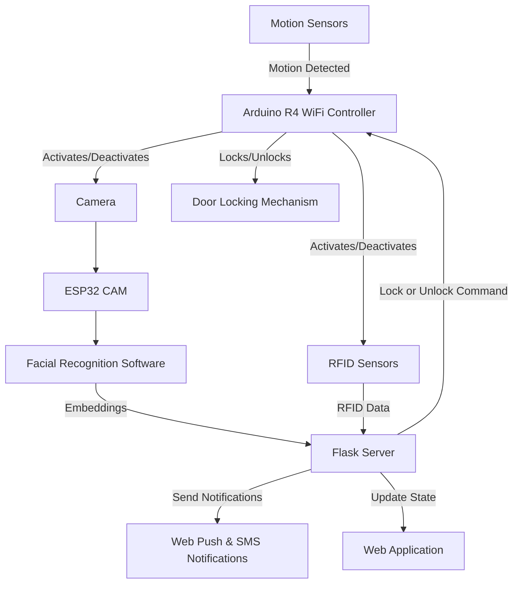

# Flow Diagram

```mermaid
graph TD
    %% Motion Detection and Initial Trigger
    MotionSensors[Motion Sensors] --> |Motion Detected| Arduino[Arduino R4 WiFi Controller]
    Arduino -->|Activates/Deactivates| RFID[RFID Sensors]
    Arduino -->|Activates/Deactivates| Camera[Camera]

    %% Camera and RFID Data Processing
    Camera --> ESP32[ESP32 CAM]
    ESP32 --> FACERECOG[Facial Recognition Software]
    FACERECOG -->|Embeddings| FlaskServer[Flask Server]
    RFID -->|RFID Data| FlaskServer

    %% Flask Server Logic
    FlaskServer -->|Lock or Unlock Command| Arduino
    Arduino --> |Locks/Unlocks| Lock[Door Locking Mechanism]

    %% Notifications and Updates
    FlaskServer -->|Send Notifications| Notifications[Web Push & SMS Notifications]
    FlaskServer -->|Update State| WebApp[Web Application]

```