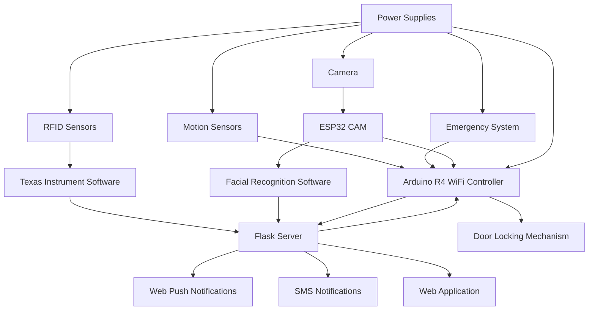

# System Overview

```mermaid
graph TD
    %% Sensors and Inputs
    MotionSensor[Motion Sensors] --> Arduino[Arduino R4 WiFi Controller]
    EMERGENCY[Emergency System] --> Arduino
    RFIDReader[RFID Sensors] --> TEXAS[Texas Instrument Software]
    Camera[Camera] --> ESP32[ESP32 CAM]
    ESP32 --> Arduino
    ESP32 --> FACERECOG[Facial Recognition Software]
    TEXAS --> FlaskServer
    FACERECOG --> FlaskServer[Flask Server]


    %% Outputs
    Arduino --> FlaskServer
    FlaskServer --> Arduino
    FlaskServer --> WEBNOTIFS[Web Push Notifications]
    FlaskServer --> TextNotifs[SMS Notifications]
    FlaskServer --> WebApp[Web Application]
    Arduino --> Lock[Door Locking Mechanism]

    %% Power Supply
    PowerSupply[Power Supplies] --> Arduino
    PowerSupply --> MotionSensor
    PowerSupply --> RFIDReader
    PowerSupply --> Camera
    PowerSupply --> EMERGENCY
```