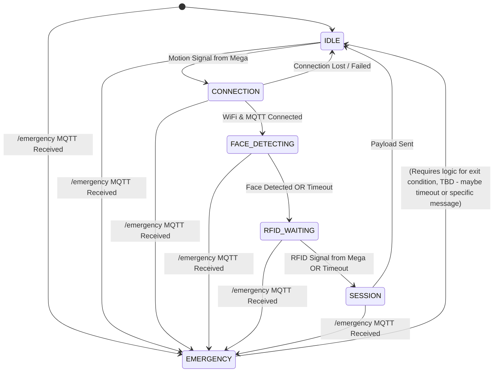

# ESP32-CAM Firmware Overview (ESP-IDF)

## 1. Introduction

This document outlines the plan and architecture for the ESP32-CAM firmware within the Campus Security Enhancement System (CSES). The ESP32-CAM is responsible for:

*   Connecting to WiFi and the MQTT Broker.
*   Receiving trigger signals (Motion Detected, RFID Detected) from the central Arduino Mega controller via GPIO.
*   Capturing images using the attached camera.
*   Performing on-device face detection using the **ESP-WHO** library.
*   Receiving emergency override messages via MQTT.
*   Constructing and publishing session data (image, face detected status, RFID detected status, etc.) to the `/session` MQTT topic.

This firmware represents a migration from an initial Arduino framework prototype (`ESP32-Arduino-Framework-NOFACEDETECTIOn`) to the **ESP-IDF** (Espressif IoT Development Framework). This migration is necessary to:

a.  Utilize the **ESP-WHO** framework for efficient face detection, which requires ESP-IDF.
b.  Implement a more robust, responsive, and non-blocking system using the multi-tasking capabilities of FreeRTOS, which underpins ESP-IDF. This is crucial for handling concurrent events like camera processing, GPIO signal detection, and MQTT messages without missing events.

## 2. Development Framework: ESP-IDF & FreeRTOS

Unlike the single-threaded Arduino `loop()`, ESP-IDF development uses **FreeRTOS**. Key differences include:

*   **Tasks:** Functionality is broken into independent tasks (e.g., a main state machine task).
*   **Concurrency:** Tasks run pseudo-concurrently, preventing long operations (like face detection) in one task from blocking others.
*   **Event-Driven:** The system primarily relies on events rather than continuous polling.
    *   **GPIO Events:** Interrupt Service Routines (ISRs) detect pin changes instantly and notify the relevant task using RTOS primitives (Queues or Event Groups).
    *   **Network Events:** ESP-IDF's WiFi and MQTT libraries handle network activity in background tasks and notify the application task via registered callback functions or event handlers, which then signal the main task.
*   **RTOS Primitives:** Queues, Event Groups, Mutexes, and Semaphores are used for inter-task communication and synchronization.

This requires a shift in thinking from a sequential polling model to an asynchronous, event-driven model.

## 3. Base Project Template

To accelerate development and leverage existing ESP-WHO integration, this project will use the structure and configuration from `klumw/esp32_cam_face_recognition` ([https://github.com/klumw/esp32_cam_face_recognition](https://github.com/klumw/esp32_cam_face_recognition)) as a starting template. We will utilize:

*   Its ESP-IDF project structure (`CMakeLists.txt`, `partitions.csv`, component configuration).
*   Its integration of the `esp-who` component as a submodule.
*   Its `sdkconfig.defaults` providing baseline configuration for ESP-WHO.
*   Potentially some boilerplate code for camera and MQTT initialization (adapted to our needs).

**Important:** The core application logic (`main.c` or similar), state machine, GPIO handling, and MQTT topic/payload logic from the `klumw` project will be heavily modified or entirely replaced to implement our specific requirements.

## 4. Iterative Development Plan (Refined Milestone 3)

The migration and feature implementation will proceed in testable phases:

**Phase 1: Base Setup & Connectivity**
*   **Goal:** Establish the basic ESP-IDF project environment, confirm build success, and implement fundamental network connectivity.
*   **Tasks:**
    *   Set up the `klumw` base project locally.
    *   Configure the ESP-IDF PowerShell environment.
    *   Build the unmodified base project (`idf.py build`).
    *   Configure basic settings (`idf.py menuconfig` - WiFi, potentially initial logging level).
    *   Implement WiFi connection logic using ESP-IDF `esp_wifi` APIs and event handlers.
    *   Implement basic MQTT client connection using `esp-mqtt` APIs and event handlers (connect to broker, log connection status).
    *   Implement basic logging using `ESP_LOGx` macros.
*   **Testing:** Verify successful connection to WiFi and MQTT broker via logs. Confirm basic log messages appear on the serial monitor.

**Phase 2: GPIO Input Handling**
*   **Goal:** Reliably detect the Motion and RFID trigger signals sent from the Arduino Mega.
*   **Tasks:**
    *   Define GPIO pin numbers for `Motion Signal In` and `RFID Signal In` in a configuration header.
    *   Configure these GPIOs as inputs with pull-ups/pull-downs as needed using `driver/gpio.h`.
    *   Implement GPIO Interrupt Service Routines (ISRs) triggered on the appropriate edge (e.g., rising edge for HIGH signal).
    *   Create a FreeRTOS Queue or Event Group for communication between ISRs and the main application task.
    *   In the ISRs, send a notification (a simple message or bit flag) to the Queue/Event Group.
*   **Testing:** Create a temporary task that waits on the Queue/Event Group. Manually trigger the input pins (using jumper wires or the Mega) and verify that the task receives the notifications and logs appropriate messages (e.g., "Motion Signal Received", "RFID Signal Received").

**Phase 3: Basic State Machine & Transitions**
*   **Goal:** Implement the core state machine structure running in a FreeRTOS task and handle basic transitions based on network and GPIO events.
*   **Tasks:**
    *   Define the `SystemState` enum (`IDLE`, `CONNECTION`, `FACE_DETECTING`, `RFID_WAITING`, `SESSION`, `EMERGENCY`).
    *   Create the main application FreeRTOS task (`app_main_task`).
    *   Implement the main loop within this task, waiting indefinitely on the Queue/Event Group from Phase 2 (and potentially incorporating MQTT/WiFi events).
    *   Implement state transition logic based on received events:
        *   `IDLE` -> `CONNECTION` (triggered by Motion Signal event).
        *   `CONNECTION` -> `FACE_DETECTING` (triggered by network ready event - WiFi & MQTT connected).
        *   Handle `CONNECTION` state logic (check network status, signal readiness).
        *   Add subscription to `/emergency` topic in MQTT setup.
        *   Handle incoming `/emergency` MQTT message event (signal main task -> transition to `EMERGENCY` state).
        *   Implement basic `EMERGENCY` state logic (log entry, perhaps block other transitions).
*   **Testing:** Verify state transitions via logging. Simulate motion signal -> check transition to `CONNECTION`. Establish network -> check transition to `FACE_DETECTING` (initially just log entry). Publish to `/emergency` -> check transition to `EMERGENCY`. Test connection loss -> check return to `CONNECTION` state.

**Phase 4: Camera & ESP-WHO Integration**
*   **Goal:** Capture images and perform face detection within the state machine flow.
*   **Tasks:**
    *   Integrate camera initialization (`esp_camera.h`, likely adapted from base project) triggered upon entering `FACE_DETECTING` state (or earlier).
    *   Implement image capture logic within the `FACE_DETECTING` state.
    *   Call ESP-WHO face detection functions on the captured frame buffer.
    *   Implement timeout logic for the `FACE_DETECTING` state.
    *   Transition from `FACE_DETECTING` to `RFID_WAITING` based on:
        *   Successful face detection.
        *   Face detection timeout.
    *   Store the `face_detected` boolean result.
*   **Testing:** Verify camera initialization works. Trigger entry into `FACE_DETECTING`. Verify image capture occurs (log size/pointer). Verify face detection function is called. Check state transitions correctly to `RFID_WAITING` after detection or timeout via logs. Log the `face_detected` result.

**Phase 5: Session Payload & Final Logic**
*   **Goal:** Complete the state machine, handle RFID signal, build the final JSON payload, and publish the session data.
*   **Tasks:**
    *   Implement `RFID_WAITING` state logic, including a timeout.
    *   Transition from `RFID_WAITING` to `SESSION` based on:
        *   Receiving the RFID Signal event from the GPIO handler.
        *   RFID wait timeout.
    *   Store the `rfid_detected` boolean result based on whether the signal was received before timeout.
    *   Implement the `SESSION` state logic:
        *   Include `cJSON` library.
        *   Build the JSON payload matching the structure defined in `api/models/session.py` (populating `device_id`, `session_id`, `timestamp`, `image_size`, `image` (if captured), `rfid_detected`, `face_detected`, `free_heap`, `state`).
        *   Publish the JSON string to the `campus/security/session` MQTT topic using `esp_mqtt_client_publish`.
        *   Transition from `SESSION` back to `IDLE` (or potentially after a short delay).
    *   Review and remove unused code/logic inherited from the `klumw` base project (e.g., boot button enrollment logic, original MQTT topics/payloads).
*   **Testing:** Trigger the full workflow: Motion -> Connection -> Face Detect/Timeout -> RFID Signal/Timeout -> Session. Verify the correct JSON payload is published to `/session` on an MQTT client. Check `rfid_detected` and `face_detected` flags are accurate based on test conditions. Ensure transition back to `IDLE` occurs.

## 5. Target State Machine

## 6. Session Payload Structure

The JSON payload published to `campus/security/session` must conform to the structure defined by the Pydantic model in `api/models/session.py`. Key fields to populate include:

*   `device_id`
*   `session_id` (generate unique ID)
*   `timestamp` (ISO 8601 format)
*   `image_size`
*   `image` (Base64 encoded, if captured)
*   `rfid_detected` (boolean based on Mega signal)
*   `face_detected` (boolean based on ESP-WHO result)
*   `free_heap`
*   `state` (e.g., "SESSION")
*   `session_duration` (Time spent from CONNECTION to SESSION publish)
*   `rfid_tag` (Will likely remain `null` as Mega only sends a signal)
