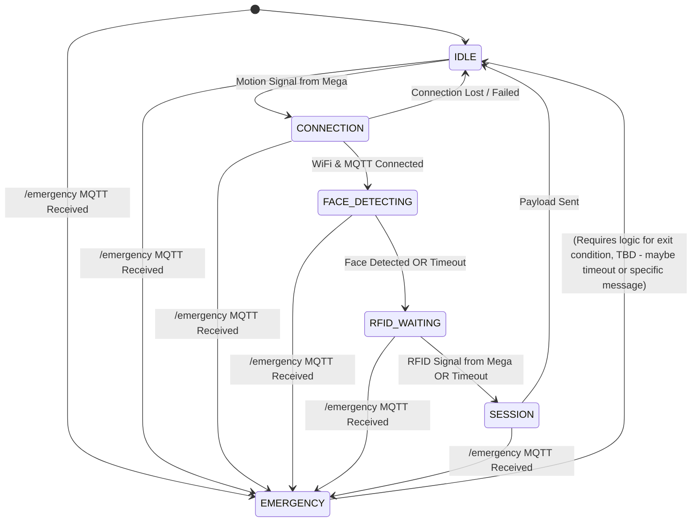

# ESP32-CAM Firmware Overview (ESP-IDF)

## 1. Introduction

This document outlines the plan and architecture for the ESP32-CAM firmware within the Campus Security Enhancement System (CSES). The ESP32-CAM is responsible for:

*   Connecting to WiFi and the MQTT Broker.
*   Receiving trigger signals (Motion Detected, RFID Detected) from the central Arduino Mega controller via GPIO.
*   Capturing images using the attached camera.
*   Performing on-device face detection using the **ESP-WHO** library.
*   Receiving emergency override messages via MQTT.
*   Constructing and publishing session data (image, face detected status, RFID detected status, etc.) to the `/session` MQTT topic.

This firmware represents a migration from an initial Arduino framework prototype (`ESP32-Arduino-Framework-NOFACEDETECTIOn`) to the **ESP-IDF** (Espressif IoT Development Framework). This migration is necessary to:

a.  Utilize the **ESP-WHO** framework for efficient face detection, which requires ESP-IDF.
b.  Implement a more robust, responsive, and non-blocking system using the multi-tasking capabilities of FreeRTOS, which underpins ESP-IDF. This is crucial for handling concurrent events like camera processing, GPIO signal detection, and MQTT messages without missing events.

## 2. Development Framework: ESP-IDF & FreeRTOS

Unlike the single-threaded Arduino `loop()`, ESP-IDF development uses **FreeRTOS**. Key differences include:

*   **Tasks:** Functionality is broken into independent tasks (e.g., a main state machine task).
*   **Concurrency:** Tasks run pseudo-concurrently, preventing long operations (like face detection) in one task from blocking others.
*   **Event-Driven:** The system primarily relies on events rather than continuous polling.
    *   **GPIO Events:** Interrupt Service Routines (ISRs) detect pin changes instantly and notify the relevant task using RTOS primitives (Queues or Event Groups).
    *   **Network Events:** ESP-IDF's WiFi and MQTT libraries handle network activity in background tasks and notify the application task via registered callback functions or event handlers, which then signal the main task.
*   **RTOS Primitives:** Queues, Event Groups, Mutexes, and Semaphores are used for inter-task communication and synchronization.

This requires a shift in thinking from a sequential polling model to an asynchronous, event-driven model.

## 2.1 Build Environment Setup Notes (CRITICAL)

Successfully building ESP-IDF projects, especially when modifying examples or switching targets, requires careful environment management:

*   **Use ESP-IDF Terminal:** Always perform build steps (`idf.py set-target`, `idf.py build`, `idf.py menuconfig`, `idf.py flash`, `idf.py monitor`) within the dedicated **ESP-IDF Terminal** launched from the VS Code/Cursor Command Palette (`Ctrl+Shift+P` -> `ESP-IDF: Open ESP-IDF Terminal`). This ensures all necessary paths and environment variables (`IDF_PATH`, etc.) are correctly set.
*   **Set Project Target:** Before the first build (and any time you switch hardware targets), explicitly set the target for your project directory:
    ```powershell
    # Example for ESP32-S3
    idf.py set-target esp32s3
    ```
*   **Clean Build After Target Change/Errors:** If you change the target using `set-target`, or if you encounter CMake configuration errors (like mismatched generators, inconsistent target errors, or file generation errors), you **must** perform a clean build:
    ```powershell
    # Option 1: Full clean (removes build directory and sdkconfig)
    idf.py fullclean
    
    # Option 2: Manual clean (if fullclean has issues)
    # Make sure you are in the project directory
    Remove-Item -Recurse -Force build
    Remove-Item -Force sdkconfig 
    ```
    After cleaning, run `idf.py build` again.
*   **Troubleshooting Target Conflicts:** If `idf.py set-target <your_target>` fails with an error about the target being inconsistent with the environment, it means the terminal session itself has a conflicting target set. To fix:
    1.  Close the current ESP-IDF Terminal.
    2.  Open a **NEW** ESP-IDF Terminal.
    3.  Navigate back to your project directory.
    4.  Run `idf.py set-target <your_target>` again.
    5.  *Alternatively (if the above fails):* Manually set the environment variable *before* cleaning and building:
        ```powershell
        $env:IDF_TARGET="esp32s3" # Set for current session
        idf.py fullclean
        idf.py build 
        ```

## 3. Base Project Template

To accelerate development and leverage existing ESP-WHO integration, this project will now use the official ESP-WHO **`human_face_detect_terminal` example** as a starting template. This example can be found within the `esp-who` repository clone (typically under `esp-who/examples/human_face_detect/human_face_detect_terminal`).

Link: [https://github.com/espressif/esp-who/tree/master/examples/human_face_detect/human_face_detect_terminal](https://github.com/espressif/esp-who/tree/master/examples/human_face_detect/human_face_detect_terminal)

We will utilize:

*   Its standard ESP-IDF project structure (`CMakeLists.txt`, component configuration).
*   Its working integration of the `esp-who` components for face detection.
*   Its baseline `sdkconfig` settings appropriate for face detection on supported targets.
*   Its boilerplate code for camera initialization.

**Important:** The core application logic (`main.c` or similar), state machine, specific GPIO handling (for Mega signals), MQTT implementation (topics, payload, our state machine integration), and overall program flow from the example will be heavily modified or entirely replaced to implement our specific requirements outlined below.

## 4. Iterative Development Plan (Refined Milestone 3)

The migration and feature implementation will proceed in testable phases, starting from the official `human_face_detect_terminal` example:

**Phase 1: Base Setup & Connectivity**
*   **Goal:** Establish the basic ESP-IDF project environment using the official example, confirm build success for the ESP32-S3 target, and implement fundamental network connectivity using programmatic configuration.
*   **Tasks:**
    - [X] Set up the official `human_face_detect_terminal` example project locally.
    - [X] Configure the ESP-IDF PowerShell environment and set target to `esp32s3`.
    - [X] Build the unmodified base example (`idf.py build`).
    - [ ] **Configure via Header:** Create a new configuration header file (e.g., `main/app_config.h`). Define necessary values like WiFi SSID, WiFi Password, and MQTT Broker URI using `#define` macros within this file. (`menuconfig` might still be used later for other settings like logging levels if needed).
    - [ ] **Adapt/Add WiFi:** Modify/Implement WiFi connection logic (`esp_wifi` APIs) to read credentials directly from `app_config.h` instead of `sdkconfig.h` (menuconfig defines). Ensure standard ESP-IDF event handlers are used.
    - [ ] **Adapt/Add MQTT:** Modify/Implement basic MQTT client connection logic (`esp-mqtt` APIs) to read the Broker URI from `app_config.h`. Connect to the broker, log status, and use standard ESP-IDF event handlers.
    - [ ] **Adapt/Add Logging:** Ensure logging uses `ESP_LOGx` macros.
*   **Note on Configuration:** We are opting to use a dedicated header file (`app_config.h`) for core network settings (WiFi SSID/Password, MQTT Broker) instead of `idf.py menuconfig` for easier direct modification in the code during initial development.
*   **Testing:** Verify successful connection to WiFi and MQTT broker via logs. Confirm basic log messages appear on the serial monitor.
*   **Code Removal Tasks:**
    - [ ] Remove Arduino WiFi includes (`WiFi.h`) and implementation (`connectToWiFi`).
    - [ ] Remove Arduino MQTT includes (`PubSubClient.h`) and implementation (`connectToMQTT`, `mqttCallback`).

**Phase 2: GPIO Input Handling**
*   **Goal:** Reliably detect the Motion and RFID trigger signals sent from the Arduino Mega.
*   **Tasks:**
    - [ ] Define GPIO pin numbers for `Motion Signal In` and `RFID Signal In` in `app_config.h`.
    - [ ] Configure these GPIOs as inputs with pull-ups/pull-downs as needed using `driver/gpio.h`.
    - [ ] Implement GPIO Interrupt Service Routines (ISRs) triggered on the appropriate edge (e.g., rising edge for HIGH signal).
    - [ ] Create a FreeRTOS Queue or Event Group for communication between ISRs and the main application task.
    *   In the ISRs, send a notification (a simple message or bit flag) to the Queue/Event Group.
*   **Testing:** Create a temporary task (or modify main task temporarily) that waits on the Queue/Event Group. Manually trigger the input pins (using jumper wires or the Mega) and verify that the task receives the notifications and logs appropriate messages (e.g., "Motion Signal Received", "RFID Signal Received").
*   **Code Removal Tasks:**
    - [ ] Remove Arduino `handleMotion` function; motion detection will now use GPIO ISRs.

**Phase 3: Basic State Machine & Transitions**
*   **Goal:** Implement the core state machine structure running in a FreeRTOS task and handle basic transitions based on network and GPIO events.
*   **Tasks:**
    - [ ] Define the `SystemState` enum (`IDLE`, `CONNECTION`, `FACE_DETECTING`, `RFID_WAITING`, `SESSION`, `EMERGENCY`).
    - [ ] Adapt the main application FreeRTOS task (`app_main` usually launches a task).
    - [ ] Implement the main loop within this task, waiting indefinitely on the Queue/Event Group from Phase 2 (and potentially incorporating MQTT/WiFi events).
    - [ ] Implement state transition logic based on received events:
        - [ ] `IDLE` -> `CONNECTION` (triggered by Motion Signal event).
        - [ ] `CONNECTION` -> `FACE_DETECTING` (triggered by network ready event - WiFi & MQTT connected).
        - [ ] Handle `CONNECTION` state logic (check network status, signal readiness).
        - [ ] Add subscription to `/emergency` topic in MQTT setup.
        - [ ] Handle incoming `/emergency` MQTT message event (signal main task -> transition to `EMERGENCY` state).
        - [ ] Implement basic `EMERGENCY` state logic (log entry, perhaps block other transitions).
*   **Testing:** Verify state transitions via logging. Simulate motion signal -> check transition to `CONNECTION`. Establish network -> check transition to `FACE_DETECTING` (initially just log entry). Publish to `/emergency` -> check transition to `EMERGENCY`. Test connection loss -> check return to `CONNECTION` state.
*   **Code Removal/Refactoring Tasks:**
    - [ ] Remove Arduino `loop()` function.
    - [ ] Remove Arduino state handler functions (`handleIdleState`, `handleConnectionState`, etc.) and `handleStateTransition`.
    - [ ] Design the main FreeRTOS task structure to manage state transitions based on events from Queues/Event Groups.

**Phase 4: Camera & ESP-WHO Integration**
*   **Goal:** Capture images and perform face detection within the state machine flow.
*   **Tasks:**
    - [ ] Adapt camera initialization (`esp_camera.h`, likely from base example) triggered upon entering `FACE_DETECTING` state (or earlier).
    - [ ] Implement image capture logic within the `FACE_DETECTING` state.
    - [ ] Call ESP-WHO face detection functions (likely present in base example) on the captured frame buffer.
    - [ ] Implement timeout logic for the `FACE_DETECTING` state.
    - [ ] Transition from `FACE_DETECTING` to `RFID_WAITING` based on:
        - [ ] Successful face detection.
        - [ ] Face detection timeout.
    - [ ] Store the `face_detected` boolean result.
*   **Testing:** Verify camera initialization works. Trigger entry into `FACE_DETECTING`. Verify image capture occurs (log size/pointer). Verify face detection function is called. Check state transitions correctly to `RFID_WAITING` after detection or timeout via logs. Log the `face_detected` result.
*   **Code Removal/Integration Tasks:**
    - [ ] Remove old Arduino `setupCamera` function and `#include <esp_camera.h>`.
    - [ ] Remove global `camera_fb_t *fb`.
    - [ ] Integrate `EloquentEsp32cam` camera initialization (`camera.begin()`) within the state machine task (likely before entering `FACE_DETECTING` or during initial setup).
    - [ ] Integrate `EloquentEsp32cam` image capture (`camera.capture()`) and face detection (`detection.run()`, etc.) within the `FACE_DETECTING` state logic.
    - [ ] Ensure all uses of `esp_camera_fb_get()` / `esp_camera_fb_return()` are replaced.

**Phase 5: Session Payload & Final Logic**
*   **Goal:** Complete the state machine, handle RFID signal, build the final JSON payload, and publish the session data.
*   **Tasks:**
    - [ ] Implement `RFID_WAITING` state logic, including a timeout.
    - [ ] Transition from `RFID_WAITING` to `SESSION` based on:
        - [ ] Receiving the RFID Signal event from the GPIO handler.
        - [ ] RFID wait timeout.
    - [ ] Store the `rfid_detected` boolean result based on whether the signal was received before timeout.
    - [ ] Implement the `SESSION` state logic:
        - [ ] Add `cJSON` component dependency (if not already included).
        - [ ] Build the JSON payload matching the structure defined in `api/models/session.py` (populating `device_id`, `session_id`, `timestamp`, `image_size`, `image` (if captured), `rfid_detected`, `face_detected`, `free_heap`, `state`).
        - [ ] Publish the JSON string to the `campus/security/session` MQTT topic using `esp_mqtt_client_publish`.
        - [ ] Transition from `SESSION` back to `IDLE` (or potentially after a short delay).
    - [ ] Review and remove unused code/logic inherited from the base example (e.g., terminal output formatting for detection results if not needed, original main loop if fully replaced).
*   **Testing:** Trigger the full workflow: Motion -> Connection -> Face Detect/Timeout -> RFID Signal/Timeout -> Session. Verify the correct JSON payload is published to `/session` on an MQTT client. Check `rfid_detected` and `face_detected` flags are accurate based on test conditions. Ensure transition back to `IDLE` occurs.
*   **Code Removal/Integration Tasks:**
    - [ ] Adapt payload creation logic from old Arduino code (`captureAndProcessImage`/`captureAndPublishImage`) to use `cJSON`, `EloquentEsp32cam` image buffer, and `esp-mqtt` within the `SESSION` state.
    - [ ] Ensure old image capture references (global `fb`, `fb->len`, `fb->buf`) are fully removed.
    - [ ] Remove Arduino helper/simulation functions (`updateLEDStatus`, `simulateRfidDetection`, `simulateEmergency`, `handleSessionTimeout`, `cleanupSession`, etc.).

## 5. Target State Machine



## 6. Session Payload Structure

The JSON payload published to `campus/security/session` must conform to the structure defined by the Pydantic model in `api/models/session.py`. Key fields to populate include:

*   `device_id`
*   `session_id` (generate unique ID)
*   `timestamp` (ISO 8601 format)
*   `image_size`
*   `image` (Base64 encoded, if captured)
*   `rfid_detected` (boolean based on Mega signal)
*   `face_detected` (boolean based on ESP-WHO result)
*   `free_heap`
*   `state` (e.g., "SESSION")
*   `session_duration` (Time spent from CONNECTION to SESSION publish)
*   `rfid_tag` (Will likely remain `null` as Mega only sends a signal)
