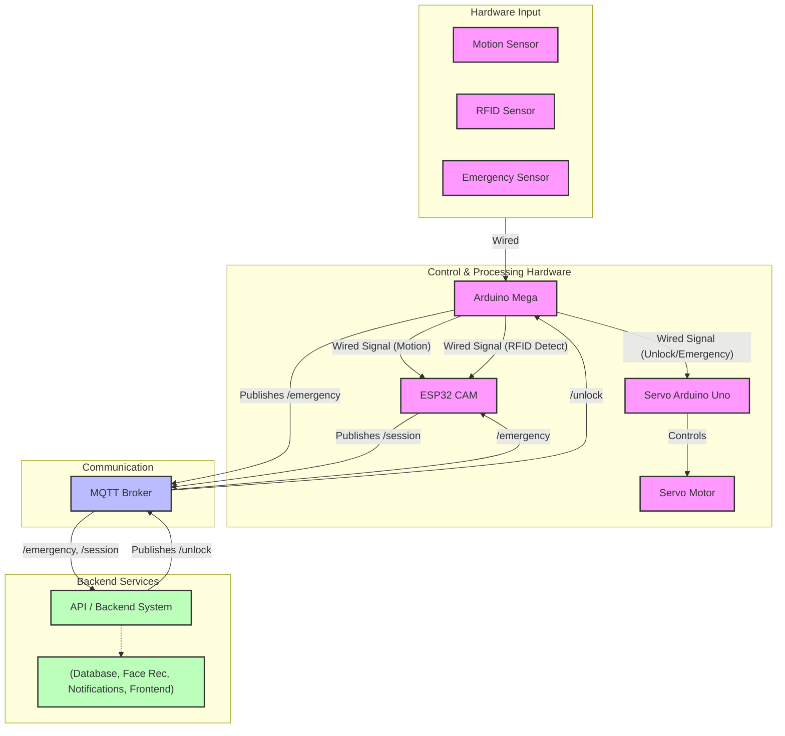

# Campus Security Enhancement System (CSES)

## 📁 Project Structure
```
├───api/                 # Flask API service
├───database/           # PostgreSQL with pgvector
├───docs/              # Documentation
├───face_recognition/  # GhostFaceNet service
├───frontend/         # React dashboard
├───mqtt_broker/      # Eclipse Mosquitto
│   ├───config/       # Broker configuration
│   ├───data/         # Message persistence
│   └───log/          # Broker logs
└───notification_service/  # Real-time alerts
```

## 🛠️ Technology Stack

| Component | Technology | Description |
|-----------|------------|-------------|
| **API** | Flask (Python) | Authentication & session management |
| **Face Detection** | ESP-WHO | On-device face detection for ESP32-CAM |
| **Face Recognition** | GhostFaceNet | 512D embedding generation |
| **Database** | PostgreSQL + pgvector | Employee records & face embeddings |
| **RFID Processing** | Arduino Mega (Central Controller) | RFID tag reading & sensor hub |
| **Motion Sensor** | PIR Sensor | Motion detection input to Mega |
| **Servo Control** | Arduino Uno | Dedicated controller for servo motor |
| **Communication** | MQTT & Direct Wire | Real-time messaging & Inter-device signaling |
| **Frontend** | React.js | Security monitoring dashboard |
| **Notifications** | ntfy (SSE) | Instant security alerts |
| **Deployment** | Docker + fly.io | Containerized deployment |

## 🏗️ System Architecture



### Core Services

#### 1. API Service (`:8080`)
- **Responsibilities**
  - Authentication flow
  - Session management
  - Security operations
  - Service integration
- **Dependencies**
  - Database
  - MQTT Broker
  - Face Recognition

#### 2. Database Service (`:5432`)
- **Features**
  - Employee records
  - Face embeddings
  - Vector similarity search
- **Configuration**
  ```yaml
  user: cses_admin
  database: cses_db
  storage: Docker volumes
  ```

#### 3. MQTT Broker (`:1883`)
- **Channels**
  - `campus/security/session`
  - `campus/security/emergency`
  - `campus/security/unlock`
- **Features**
  - Message persistence
  - Configurable security
  - Comprehensive logging

### 🐳 Docker Architecture

```yaml
services:
  api:
    build: ./api
    ports: ["8080:8080"]
    networks: [app-network, mqtt-network]
    depends_on: [db, mosquitto]

  db:
    image: ankane/pgvector:latest
    ports: ["5432:5432"]
    networks: [app-network]
    volumes: [postgres_data, init.sql, migrations]

  mosquitto:
    image: eclipse-mosquitto:latest
    ports: ["1883:1883"]
    networks: [mqtt-network, app-network]
    volumes: [config, data, log]
```

### 🔌 Network Configuration
- **app-network**: API ↔ Database communication
- **mqtt-network**: MQTT messaging

### 💾 Volume Management
- **Database**: `postgres_data`
- **MQTT**: 
  - `mosquitto_data`
  - `mosquitto_log`
  - `mosquitto_config`

## 🔄 Data Flow

### Session Flow
1. **Motion Detection** (Arduino Mega)
   - Reads motion sensor input.
   - Sends "Motion Detected" signal to ESP32 via direct wire.
2. **RFID Detection** (Arduino Mega)
   - Reads RFID sensor input (via pull-up resistor).
   - Generates mock RFID data.
   - Sends "RFID Detected" signal to ESP32 via direct wire.
3. **Session Creation & Image Capture** (ESP32)
   - Receives signals from Mega.
   - Enters active state upon motion signal.
   - Performs Face Detection until a face is detected or a timeout occurs. If a face is detected, it records `face_detected` status (true/false) based on its own processing result. If no face is detected, it records `face_detected` status (false).
   - Captures an image and records `image_data` (always included if capture succeeded).
   - Records `rfid_detected` status (true/false) based on signal from Mega.
   - Records `face_detected` status (true/false) based on its own processing result.
   - Creates JSON payload including session ID, image data (always included if capture succeeded), `rfid_detected` status, and `face_detected` status.
     ```json
     {
       "device_id": "esp32-cam-id",
       "session_id": "unique-uuid",
       "timestamp": "iso8601-timestamp",
       "image_size": 12345,
       "image_data": "base64_encoded_image",
       "rfid_detected": true,
       "face_detected": false,
       "free_heap": 50000,
       "state": "SESSION"
     }
     ```
   - Publishes payload to `campus/security/session` MQTT topic.
4. **Processing** (API)
   - Receives MQTT payload from `campus/security/session`.
   - Validates session data.
   - Determines verification path based on `rfid_detected`, `face_detected`, and presence of `image_data` and `rfid_tag`:
       - RFID + Detected Face: Verify face embedding against RFID owner's.
       - RFID + No Detected Face: Flag for manual review (RFID_ONLY_PENDING_REVIEW). Admin sees employee details and the image (which lacked a face).
       - No RFID + Detected Face: Attempt face search, flag for manual review (FACE_ONLY_PENDING_REVIEW). Admin sees image and potential matches.
       - Other cases (Incomplete Data, Errors): Handle accordingly.
   - Logs access attempt, including `review_status` (e.g., 'approved' if RFID+Face succeeds, 'pending' otherwise).
   - Triggers actions (e.g., publish to `campus/security/unlock` if access granted or approved manually).

### Emergency Flow
1. **Detection** (Arduino Mega)
   - Reads emergency sensor input.
   - Immediately triggers unlock signal to the connected Arduino Uno (for servo).
   - Sends MQTT message to `campus/security/emergency`.

2. **Processing** (API)
   - Receives MQTT message from `campus/security/emergency`
   - Logs event
   - Stops session processing

3. **Processing** (ESP32)
   - Receives MQTT message from `campus/security/emergency`
   - Suspends face capture and session creation
   - Upon received mqtt message, sets emergency flag to true
   - Continues face capture but does not process sessions

## 🚀 Development

### Local Setup
```powershell
# Start core services
docker-compose up api db mosquitto

# Start specific service
docker-compose up [service_name]

# View logs
docker-compose logs -f [service_name]
```

### Service Dependencies
- API → Database
- API → MQTT
- All services → Docker networks

## 🔒 Security
- Network isolation
- Environment variables
- Persistent storage
- Health monitoring

## 📡 MQTT Channels

### Session Channel
- **Topic**: `campus/security/session`
- **Publisher**: ESP32CAM
- **Subscriber**: API
- **Purpose**: Session payload transmission

### Emergency Channel
- **Topic**: `campus/security/emergency`
- **Publisher**: Arduino
- **Subscriber**: API, ESP32
- **Purpose**: Emergency override

### Unlock Channel
- **Topic**: `campus/security/unlock`
- **Publisher**: API
- **Subscriber**: Arduino
- **Purpose**: Door control

