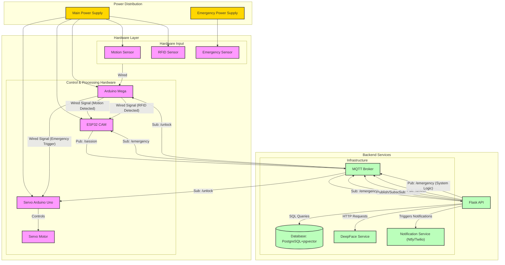

# Campus Security Enhancement System (CSES)

## 📁 Project Structure
```
├───api/                 # Flask API service 
├───database/           # PostgreSQL with pgvector
├───docs/              # Documentation (includes frontend-overview.md)
├───face_recognition/  # GhostFaceNet service (DEPRECATED - Using DeepFace Docker image)
├───mqtt_broker/      # Eclipse Mosquitto
│   ├───config/       # Broker configuration
│   ├───data/         # Message persistence
│   └───log/          # Broker logs
├───ESP32-WROVER/     # ESP32-CAM code
├───ArduinoMega/      # Arduino Mega code
├───ServoArduinoUno/  # Arduino Uno code for servo control
├───docker-compose.yml # Docker compose file
├───README.md          # Project overview

```

## 🛠️ Technology Stack

| Component | Technology | Description |
|-----------|------------|-------------|
| **API & Frontend** | Flask + Jinja2 | Server-side rendering, authentication, and session management |
| **UI Framework** | Bootstrap 5 | Responsive styling and components |
| **Face Detection** | Eloquet32Cam | On-device face detection for ESP32-CAM |
| **Face Recognition** | DeepFace | 512D embedding generation |
| **Database** | PostgreSQL + pgvector | Employee records & face embeddings |
| **RFID Processing** | Arduino Mega (Central Controller) | RFID tag reading & sensor hub |
| **Motion Sensor** | PIR Sensor | Motion detection input to Mega |
| **Servo Control** | Arduino Uno | Dedicated controller for servo motor |
| **Communication** | MQTT & Direct Wire | Real-time messaging & Inter-device signaling |
| **Storage** | Supabase Storage | Image and file storage |
| **Notifications** | Ntfy (Web Push) / Twilio (SMS) | Configurable security alerts |
| **Deployment** | Docker + fly.io | Containerized deployment |

## 🏗️ System Architecture



### Core Services

#### 1. API Service (`api/`, `:8080`)
- **Responsibilities**
  - Provides RESTful API endpoints for the frontend.
  - Handles authentication and session management.
  - Orchestrates interactions between frontend, database, MQTT, face recognition, and notifications.
  - Processes incoming `/session` data from ESP32 via MQTT.
  - Publishes `/unlock` and `/emergency` commands via MQTT.
  - Subscribes to `/emergency` to maintain system state.
- **Dependencies**
  - Database Service
  - MQTT Broker
  - DeepFace Service (or configured face recognition service)
  - Notification Service
#### 3. Database Service (`database/`, `:5432`)
- **Features**
  - Employee records
  - Face embeddings
  - Vector similarity search
- **Configuration**
  ```yaml
  user: cses_admin
  database: cses_db
  storage: Docker volumes
  ```

#### 4. MQTT Broker (`mqtt_broker/`, `:1883`)
- **Channels**
  - `campus/security/session`: ESP32 -> API (Session data)
  - `campus/security/emergency`: API -> ESP32, API (Emergency broadcast)
  - `campus/security/unlock`: API -> Mega (Unlock command)
- **Features**
  - Message persistence
  - Configurable security
  - Comprehensive logging

### 🐳 Docker Architecture

```yaml
# Note: This represents the core backend services.
# The React frontend typically runs via Node.js during development
# and is built into static files served by a webserver (like Nginx) or the API in production.
# A 'frontend' service definition can be added for containerized deployment.

services:
  api:
    build: ./api
    ports: ["8080:8080"]
    # ... (environment vars, volumes etc. as before) ...
    depends_on:
      postgres:
        condition: service_healthy
      deepface:
        condition: service_started # Or service_healthy if available
      mosquitto:
        condition: service_started
    networks: [cses_network] # Adjusted network name

  # Renamed from 'db' to 'postgres' for clarity
  postgres:
    image: ankane/pgvector:latest
    ports: ["5432:5432"]
    # ... (environment, volumes, healthcheck as before) ...
    networks: [cses_network]

  # Using DeepFace official image
  deepface:
    image: serengil/deepface:latest
    container_name: deepface_service
    restart: unless-stopped
    ports: ["5001:5000"] # Host 5001 -> Container 5000
    networks: [cses_network]

  mosquitto:
    image: eclipse-mosquitto:latest
    container_name: mosquitto
    ports: ["1883:1883"]
    volumes:
      # Paths relative to docker-compose.yml at root
      - ./mqtt_broker/config/mosquitto.conf:/mosquitto/config/mosquitto.conf
      - ./mqtt_broker/data:/mosquitto/data
      - ./mqtt_broker/log:/mosquitto/log
    networks: [cses_network]
    restart: unless-stopped

  # Placeholder for potential containerized frontend deployment
  # frontend:
  #   build: ./frontend
  #   ports: ["3000:80"] # Example: Host 3000 -> Container webserver on 80
  #   depends_on: [api]
  #   networks: [cses_network]

networks:
  cses_network:
    name: cses_network

volumes:
  postgres_data:
    name: cses_postgres_data
  # mosquitto volumes defined implicitly via bind mounts
```

### 🔌 Network Configuration
- **app-network**: API ↔ Database communication
- **mqtt-network**: MQTT messaging

### 💾 Volume Management
- **Database**: `postgres_data`
- **MQTT**: 
  - `mosquitto_data`
  - `mosquitto_log`
  - `mosquitto_config`

## 🔄 Data Flow

### Session Flow
1. **Motion Detection** (Arduino Mega)
   - Reads motion sensor input (Active HIGH).
   - Sends "Motion Detected" signal (HIGH) to ESP32 via direct wire.
2. **RFID Detection** (Arduino Mega)
   - Reads RFID sensor input (Active HIGH, no pull-up).
   - Generates mock RFID data.
   - Sends "RFID Detected" signal (HIGH) to ESP32 via direct wire.
3. **Session Creation & Image Capture** (ESP32)
   - Receives signals from Mega.
   - Enters active state upon motion signal.
   - Performs Face Detection until a face is detected or a timeout occurs. If a face is detected, it records `face_detected` status (true/false) based on its own processing result. If no face is detected, it records `face_detected` status (false).
   - Captures an image and records `image_data` (always included if capture succeeded).
   - Records `rfid_detected` status (true/false) based on signal from Mega.
   - Records `face_detected` status (true/false) based on its own processing result.
   - Creates JSON payload including session ID, image data (always included if capture succeeded), `rfid_detected` status, and `face_detected` status.
     ```json
     {
       "device_id": "esp32-cam-id",
       "session_id": "unique-uuid",
       "timestamp": "iso8601-timestamp",
       "image_size": 12345,
       "image_data": "base64_encoded_image",
       "face_detected": false,
       "rfid_detected": true,
       "rfid_tag": "1234567890"
     }
     ```
   - Publishes payload to `campus/security/session` MQTT topic.
4. **Processing** (API)
   - Receives MQTT payload from `campus/security/session`.
   - Validates session data.
   - Determines verification path based on `rfid_detected`, `face_detected`, and presence of `image_data` and `rfid_tag`:
       - RFID + Detected Face: Verify face embedding against RFID owner's.
       - RFID + No Detected Face: Flag for manual review (RFID_ONLY_PENDING_REVIEW). Admin sees employee details and the image (which lacked a face).
       - No RFID + Detected Face: Attempt face search, flag for manual review (FACE_ONLY_PENDING_REVIEW). Admin sees image and potential matches.
       - Other cases (Incomplete Data, Errors): Handle accordingly.
   - Logs access attempt, including `review_status` (e.g., 'approved' if RFID+Face succeeds, 'pending' otherwise).
   - Triggers actions (e.g., publish to `campus/security/unlock` if access granted or approved manually).

  5. **Emergency Flow**
     - Receives MQTT message from `campus/security/emergency`
     - Suspends face capture and session creation
     - Upon received mqtt message, sets emergency flag to true
  6. **Frontend View**
     - Displays emergency flag and emergency message

### Emergency Flow
1. **Detection** (Arduino Mega)
   - Reads emergency sensor input (Active LOW).
   - Immediately triggers unlock signal (HIGH pulse) to the connected Arduino Uno (for servo).
   - Mega does NOT send MQTT message directly.

2. **Processing** (API)
   - Receives MQTT message from `campus/security/emergency` (Published by API/System based on other logic, TBD).
   - Logs event.
   - Stops session processing (If applicable).

3. **Processing** (ESP32)
   - Receives MQTT message from `campus/security/emergency`
   - Suspends face capture and session creation
   - Upon received mqtt message, sets emergency flag to true
   - Continues face capture but does not process sessions

## 🚀 Development

### Local Setup

```powershell
# Change to the project root directory first

# Start core backend services defined in docker-compose.yml
docker-compose up -d api postgres deepface mosquitto

# Stop services
docker-compose down

# View logs for a specific service (e.g., api)
docker-compose logs -f api
```

### Service Dependencies
- Frontend → API
- API → Database (PostgreSQL)
- API → MQTT Broker
- API → DeepFace Service
- API → Notification Service (Internal logic)

## 🔒 Security
- Network isolation
- Environment variables
- Persistent storage
- Health monitoring

## 📡 MQTT Channels

### Session Channel
- **Topic**: `campus/security/session`
- **Publisher**: ESP32CAM
- **Subscriber**: API
- **Purpose**: Session payload transmission

### Emergency Channel
- **Topic**: `campus/security/emergency`