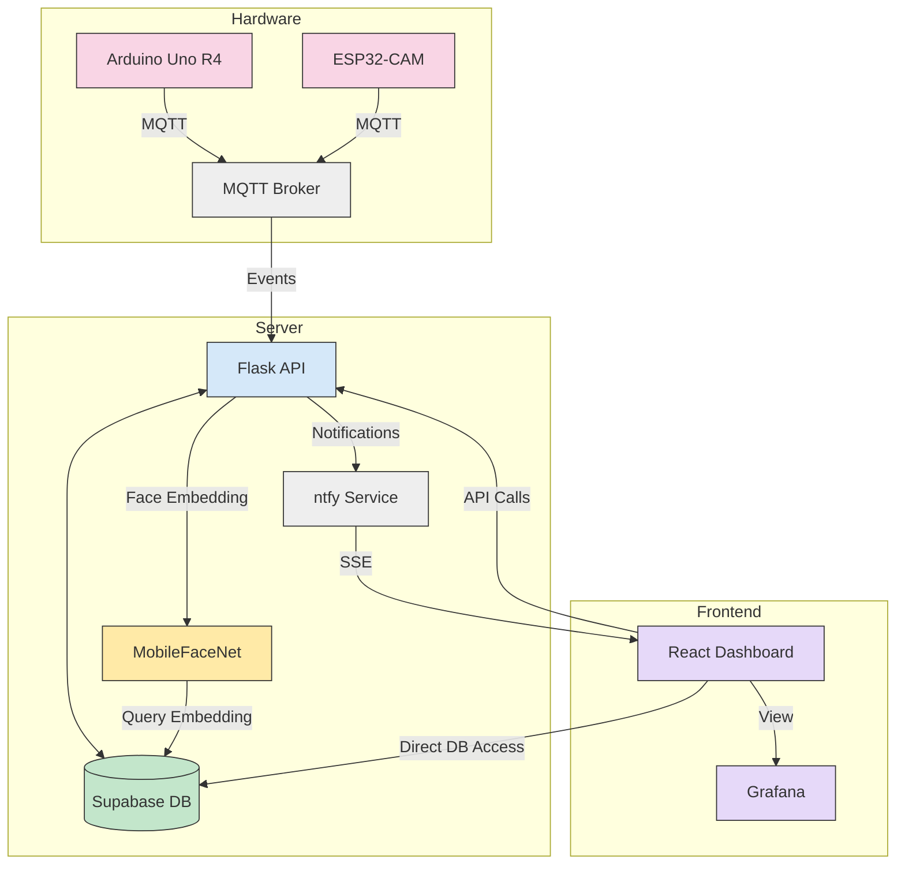
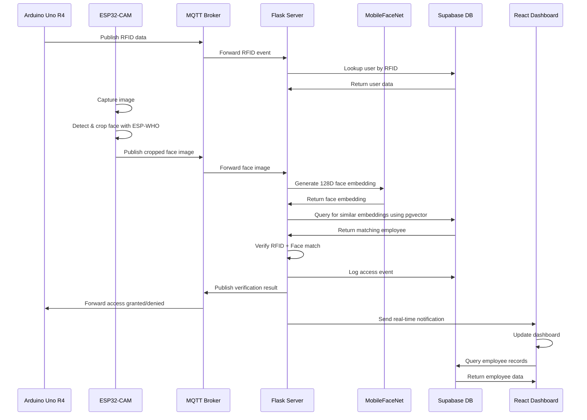
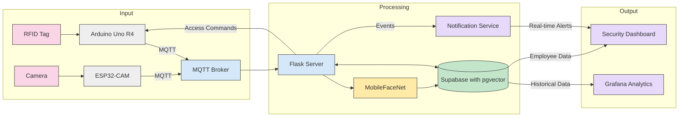
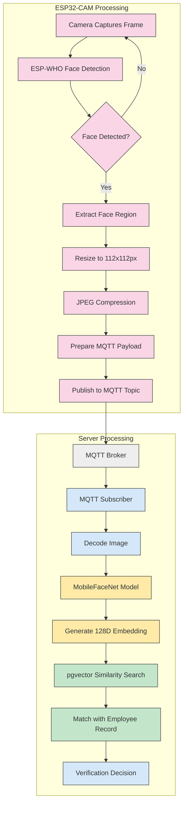
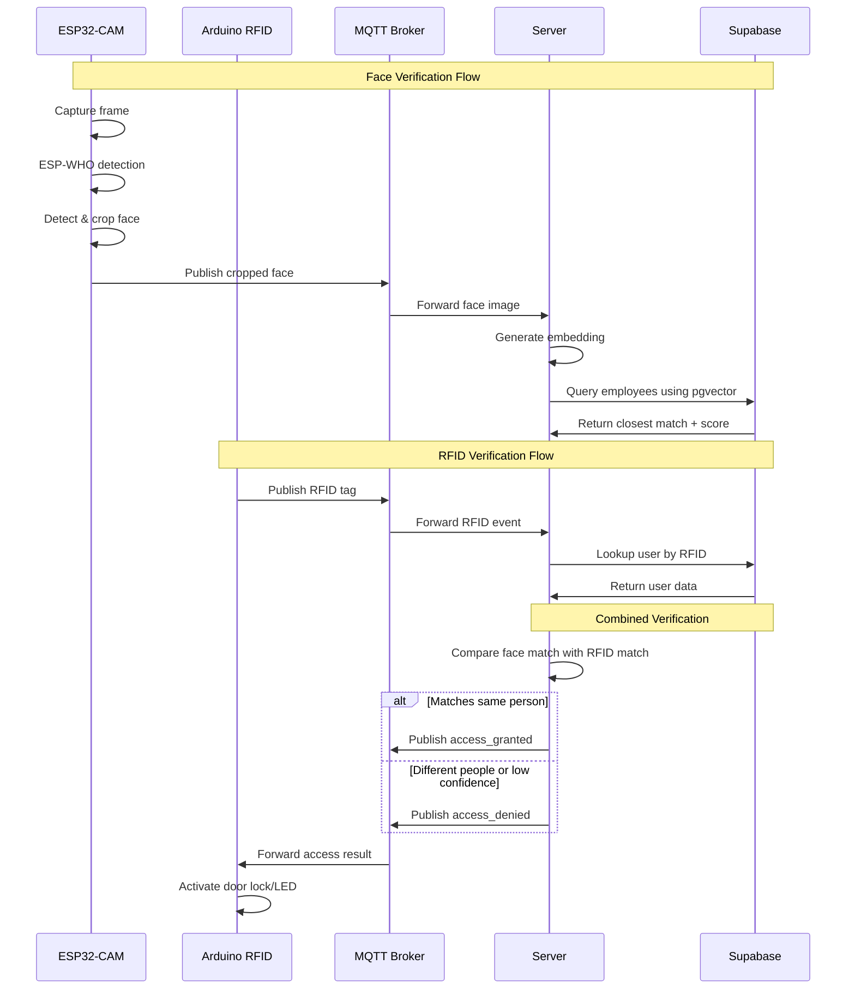

# Campus Security and Evacuation System

## Product Vision

The Campus Security and Evacuation System aims to provide a comprehensive, modular security solution that combines physical access control (RFID) with biometric verification (facial recognition) to secure campus entry points. The system provides real-time monitoring capabilities for security personnel, maintains access logs for auditing, and enhances overall campus safety.

### Long-Term Goals

1. **Seamless Authentication**: Create a frictionless security experience while maintaining high verification standards
2. **Edge Computing**: Move computational workloads to edge devices to reduce latency and bandwidth requirements
3. **Real-Time Monitoring**: Provide security personnel with instant alerts and comprehensive monitoring tools
4. **Scalable Architecture**: Support deployment across multiple campus buildings with centralized management
5. **Data-Driven Insights**: Enable security pattern analysis and predictive capabilities

## Tech Stack Breakdown

| Component | Technology | Description |
|-----------|------------|-------------|
| **Server Backend** | Flask (Python) | API endpoints for authentication flow, session management, and security operations |
| **Face Detection** | ESP-WHO Framework | On-device face detection for ESP32-CAM to detect and crop faces locally |
| **Face Embedding** | MobileFaceNet | Lightweight, server-side model to generate 128D embeddings from detected faces |
| **Database** | Supabase with pgvector | Store employee records with their face embeddings for direct similarity search |
| **RFID Processing** | Arduino Uno R4 | Reads RFID tags and communicates with central server |
| **Communication Protocol** | MQTT | Publish/subscribe messaging for real-time communication between components |
| **Frontend Dashboard** | React.js | Security monitoring interface for personnel |
| **Real-Time Notifications** | ntfy (SSE) | Server-sent events for instant security alerts |
| **Monitoring** | Grafana | Visualization of system metrics and access events |
| **Deployment** | Docker + fly.io | Containerized deployment for scalability and zero-cost hosting |

## System Interaction Diagrams

### High-Level Architecture



### Face Recognition System Flow

```mermaid
flowchart LR
    subgraph ESP32CAM[ESP32-CAM Edge Device]
        C[Capture Image] --> FD[Face Detection with ESP-WHO]
        FD --> CR[Crop Face]
        CR --> SND[Send via MQTT/HTTP]
    end
    
    SND --> RCV
    
    subgraph Server[Server Processing]
        RCV[Receive Image] --> MFN[MobileFaceNet: Generate 128D Embedding]
        MFN --> QRY[Query Supabase with pgvector]
        QRY --> IDT[Identify Person or Unknown]
        IDT --> VER[Verification Result]
    end
    
    VER --> NTF[Send Notification]
    NTF --> UI[Update Dashboard]

    style C fill:#f9d5e5,stroke:#333,stroke-width:1px
    style FD fill:#f9d5e5,stroke:#333,stroke-width:1px
    style CR fill:#f9d5e5,stroke:#333,stroke-width:1px
    style SND fill:#f9d5e5,stroke:#333,stroke-width:1px
    style RCV fill:#d5e8f9,stroke:#333,stroke-width:1px
    style MFN fill:#ffeaa7,stroke:#333,stroke-width:1px
    style QRY fill:#c3e6cb,stroke:#333,stroke-width:1px
    style IDT fill:#d5e8f9,stroke:#333,stroke-width:1px
    style VER fill:#d5e8f9,stroke:#333,stroke-width:1px
    style NTF fill:#e6d9f9,stroke:#333,stroke-width:1px
    style UI fill:#e6d9f9,stroke:#333,stroke-width:1px
```



### Authentication Flow Sequence



### Data Flow Diagram



## Database Structure

The system uses Supabase as an integrated database solution with the following key components:

1. **Employee Records with Face Embeddings**: 
   - Stores complete employee information alongside their facial biometrics
   - Each employee record includes a 128D face embedding vector generated by MobileFaceNet
   - Utilizes pgvector extension to enable similarity search on these embeddings
   - Frontend directly queries this table for employee management operations

2. **Access Logs**: 
   - Records all access attempts, both successful and failed
   - Timestamps, locations, verification methods, and results
   - Used for security auditing and pattern analysis

3. **Notification History**: 
   - Archives system notifications and alerts
   - Categorized by severity and type
   - Queryable for generating reports and analytics

### Database Schema

#### Employees Table

| Column Name | Data Type | Description |
|-------------|-----------|-------------|
| id | UUID | Primary key, unique identifier |
| name | String | Employee's full name |
| rfid_tag | String | RFID tag associated with employee |
| face_embedding | Vector(128) | 128-dimensional face embedding vector |
| role | String | Employee role (e.g., "Staff", "Admin", "Security") |
| email | String | Employee's email address |
| created_at | Timestamp | Record creation timestamp |
| active | Boolean | Whether the employee is currently active |

#### Access Logs Table

| Column Name | Data Type | Description |
|-------------|-----------|-------------|
| id | UUID | Primary key, unique identifier |
| employee_id | UUID | Foreign key to employees table |
| timestamp | Timestamp | When the access attempt occurred |
| access_granted | Boolean | Whether access was granted |
| verification_method | String | "RFID", "Face", "Both" |
| similarity_score | Float | Face similarity score (if applicable) |
| session_id | String | Session identifier for the verification process |

#### Notifications Table

| Column Name | Data Type | Description |
|-------------|-----------|-------------|
| id | UUID | Primary key, unique identifier |
| type | String | Notification type (e.g., "ACCESS_DENIED", "UNKNOWN_PERSON") |
| severity | String | "INFO", "WARNING", "ALERT", "CRITICAL" |
| message | String | Notification message content |
| timestamp | Timestamp | When the notification was generated |
| related_employee_id | UUID | Foreign key to employees table (if applicable) |
| acknowledged | Boolean | Whether the notification has been acknowledged |

## Face Recognition System Benefits

1. **Efficient Resource Utilization**:
   - ESP32-CAM handles only lightweight face detection, not overloading the edge device
   - MobileFaceNet runs on the server but is optimized to work efficiently on CPU, requiring no GPU

2. **Cost-Effective Solution**:
   - MobileFaceNet is free, small, accurate, and fast
   - Supabase with pgvector provides vector search within the free tier limits
   - Entire face recognition pipeline operates without additional infrastructure costs

3. **Integrated Database Approach**:
   - Employee data and biometric information stored in the same table for simplified queries
   - pgvector extension allows for efficient similarity search directly on employee records
   - Single source of truth for all employee-related data

4. **Improved Accuracy**:
   - Two-stage approach (detection on edge, recognition on server) balances performance and accuracy
   - MobileFaceNet produces high-quality 128D embeddings optimized for facial recognition
   - pgvector enables efficient similarity search for fast and accurate identification

## Architectural Considerations

### Current Bottlenecks

1. **TensorFlow Implementation**
   - **Issue**: The current 553MB TensorFlow model is oversized and causing dependency issues with Python 3.11.
   - **Improvement**: Replace with the ESP-WHO framework for detection on ESP32-CAM and MobileFaceNet (much smaller) for embeddings on the server.

2. **HTTP Communication**
   - **Issue**: Current HTTP-based approach lacks real-time capabilities and requires maintaining sessions.
   - **Improvement**: Implement MQTT for pub/sub communication, enabling real-time event notification without polling.

3. **Database Structure**
   - **Issue**: Current implementation uses JSON files and has no structured database design.
   - **Improvement**: Implement integrated Supabase tables for employees with their face embeddings, access events, and notifications using pgvector for similarity search.

### Security Considerations

1. **Data Privacy**
   - **Current Issue**: Face data and RFID information needs stronger protection.
   - **Improvement**: Implement proper encryption for data at rest and in transit.

### Testing Strategy

1. **Component Testing**
   - Implement unit tests for core server components
   - Create hardware simulation for testing device integration

2. **Integration Testing**
   - Develop automated test suite for the complete verification flow
   - Implement CI/CD pipeline with integration tests

## Face Recognition Implementation Flow

### ESP32-CAM Processing Pipeline



### Implementation Details

#### ESP32-CAM with ESP-WHO Framework

1. **Camera Initialization**:
   - ESP32-CAM initializes its OV2640 camera with VGA resolution (640x480)
   - Camera is configured for medium quality (JPEG compression level ~20)
   - Frame rate is set to 10-15 FPS to balance performance and detection quality

2. **Face Detection Process**:
   - ESP-WHO framework runs locally on the ESP32-CAM
   - Utilizes lightweight frontal face detection model optimized for microcontrollers
   - Detection runs on every 2-3 frames to conserve processing power
   - When a face is detected, the framework provides bounding box coordinates

3. **Image Preprocessing**:
   - The face region is cropped using the bounding box coordinates (adds 20px padding)
   - Cropped image is resized to 112x112 pixels (optimal for MobileFaceNet input)
   - Basic contrast normalization is applied if lighting conditions are poor
   - Final image is compressed as JPEG with quality level of 80

4. **MQTT Communication**:
   - ESP32-CAM connects to MQTT broker running on a dedicated server or fly.io
   - Authentication uses username/password with TLS encryption
   - Face images are published to topic: `campus/security/{device_id}/face`
   - Metadata included: timestamp, session ID, device ID, battery level
   - QoS level 1 ensures delivery even with temporary network issues

#### Server-Side Processing

1. **MQTT Subscription**:
   - Server subscribes to all face detection topics using wildcard: `campus/security/+/face`
   - Received messages are placed in a processing queue to handle traffic spikes
   - Each message is decoded to extract the JPEG image and metadata

2. **Embedding Generation**:
   - MobileFaceNet processes the received face image
   - Model generates a compact 128-dimensional face embedding vector
   - Embedding represents unique facial features in normalized vector space
   - Typical processing time: <50ms per image on CPU

3. **Database Querying**:
   - The 128D embedding is used to query the employee records in Supabase
   - pgvector extension performs cosine similarity search against stored embeddings
   - Query returns the closest matching employee record and similarity score
   - Matching threshold is configurable (default: 0.75 similarity)

### MQTT Broker Setup

For development, the system uses a local Mosquitto broker running in Docker:

```bash
# Start local MQTT broker for development
docker run -it -p 1883:1883 -p 9001:9001 eclipse-mosquitto
```

For production, the broker is deployed on fly.io with the following configuration:

```
# mosquitto.conf (production)
persistence true
persistence_location /mosquitto/data/

allow_anonymous false
password_file /etc/mosquitto/passwd

cafile /etc/mosquitto/certs/rootCA.pem
certfile /etc/mosquitto/certs/mqtt-server.crt
keyfile /etc/mosquitto/certs/mqtt-server.key
require_certificate false
tls_version tlsv1.2
```

### Verification Sequence



### Image Quality Considerations

The system includes several mechanisms to ensure high-quality face recognition:

1. **Lighting Adaptation**:
   - ESP32-CAM performs basic exposure adjustment based on ambient lighting
   - Server can request higher-quality image if initial quality is insufficient

2. **Multiple Frame Capture**:
   - If confidence score is below threshold but close, system requests additional frames
   - Server can average multiple embeddings to improve accuracy

3. **Anti-Spoofing Measures**:
   - Basic liveness detection using motion analysis between frames
   - Infrared illuminator option for low-light conditions and additional verification

4. **Failure Handling**:
   - Graceful degradation to RFID-only verification if face recognition fails
   - User notification for repeated recognition failures